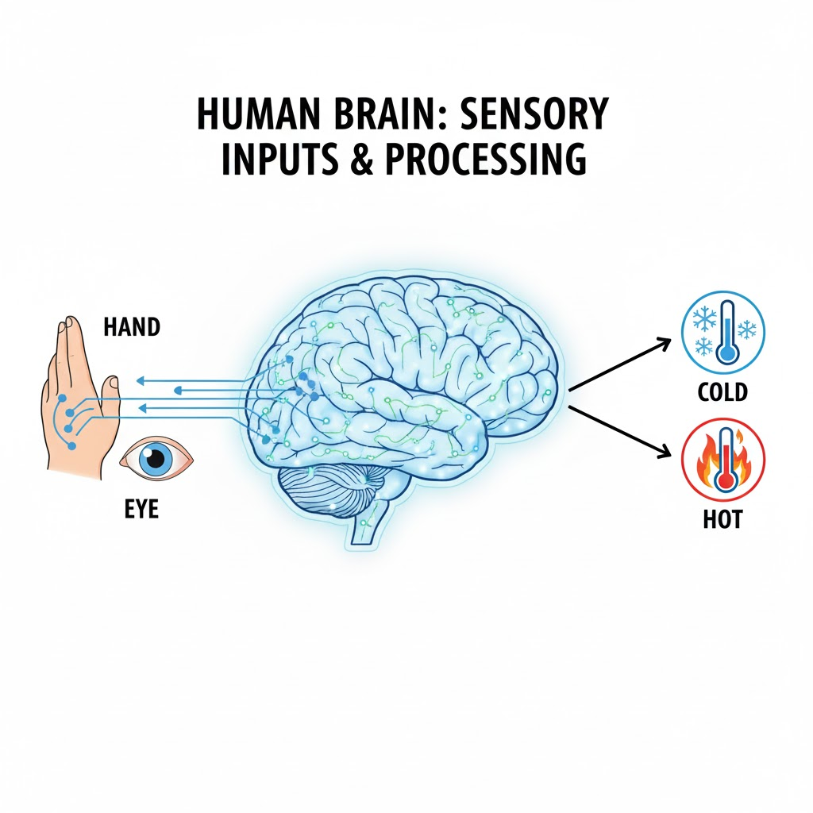
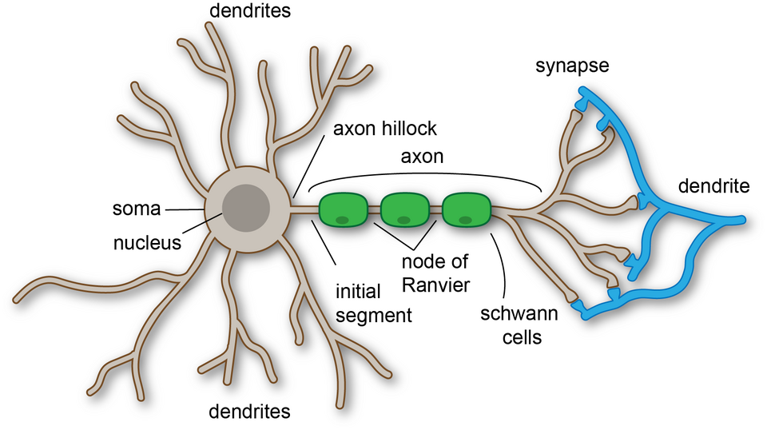
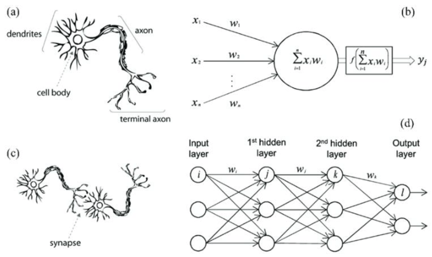
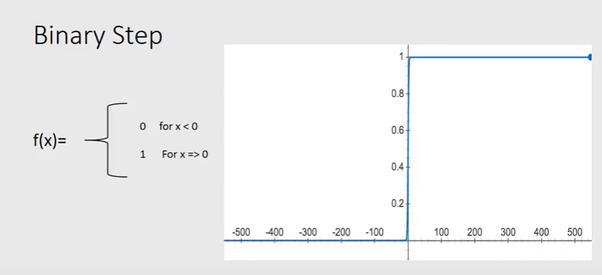

# Lab 01: Understanding the Single Neuron

## Neural Networks Course - Computer Engineering

---

## 📋 Lab Information

**Difficulty:** Beginner  
**What You'll Learn:**

- How artificial neurons mimic biological neurons
- The mathematics behind neural networks
- How to implement a neuron in Python
- Practical classification problems

**Files You'll Need:**

- `student-guide.md` (this file)
- `python-basics.py` (Python tutorial)
- `neuron-implementation.py` (implementation examples)
- `student-task.py` (your assignment)

---

## 🎯 Introduction

Welcome to your first Neural Networks lab! Today, you'll learn how computers can make decisions similar to how your brain works. We'll use a simple example: determining if a water bottle in your hand is **cold** or **hot**.

---

## 🧠 Part 1: The Biological Analogy

### How Your Brain Classifies Things

Think about holding a water bottle. How do you know if it's cold or hot? Your brain uses multiple sources of information:



#### Your Inputs:

1. **Touch** - Your hand feels the temperature
2. **Visual cues** - You might see condensation (cold) or steam (hot)
3. **Context** - Room temperature, time of day, etc.

#### Processing:

Your brain doesn't treat all inputs equally:

- **Touch** is most important (70%)
- **Visual cues** are helpful (20%)
- **Context** adds a bit more (10%)

#### Output:

Your brain combines these inputs and decides: **COLD** or **HOT**

This is exactly how an artificial neuron works!

---

### The Human Neuron



Your brain has billions of neurons. Each neuron:

- **Receives signals** through dendrites (inputs)
- **Processes signals** in the cell body (weighted sum)
- **Sends output** through the axon (output)
- **Connection strength** varies at synapses (weights)

An artificial neuron mimics this structure mathematically!

---

## 📐 Part 2: The Mathematics

### The Mathematical Neuron

Let's build the math step by step!



#### Step 1: Inputs

Let's assign numbers to our water bottle inputs:

```
x₁ = Temperature from touch (scale: -10 to +10)
     -10 = very cold, 0 = neutral, +10 = very hot

x₂ = Visual cues (scale: -5 to +5)
     -5 = lots of condensation, 0 = nothing visible, +5 = steam

x₃ = Context (scale: -3 to +3)
     -3 = refrigerator, 0 = room temp, +3 = direct sunlight
```

**Example:**

```
x₁ = 8   (feels quite hot)
x₂ = 3   (some steam visible)
x₃ = 1   (in a warm room)
```

---

#### Step 2: Weights (Importance)

Each input has a **weight** that shows its importance:

```
w₁ = 0.7  (touch is 70% important)
w₂ = 0.2  (visual is 20% important)
w₃ = 0.1  (context is 10% important)
```

**Note:** Weights sum to 1.0 (100%) for easy interpretation, though this isn't required.

---

#### Step 3: Weighted Sum

Now we calculate how "hot" the overall signal is:

$$
z = w_1 \cdot x_1 + w_2 \cdot x_2 + w_3 \cdot x_3 + b
$$

**Symbol Guide:**

- **z** = net input (total signal strength)
- **wᵢ** = weight for input i
- **xᵢ** = value of input i
- **b** = bias (threshold adjustment)
- **·** = multiplication

**Expanded form:**

$$
z = (w_1 \times x_1) + (w_2 \times x_2) + (w_3 \times x_3) + b
$$

**Calculate it:**

```
Given: x₁=8, x₂=3, x₃=1, w₁=0.7, w₂=0.2, w₃=0.1, b=-2

z = (0.7 × 8) + (0.2 × 3) + (0.1 × 1) + (-2)
z = 5.6 + 0.6 + 0.1 - 2
z = 4.3
```

---

#### Step 4: What is Bias?

The **bias (b)** is like adjusting your personal preference:

- **b = -2**: You're skeptical (need strong evidence for "hot")
- **b = 0**: You're neutral
- **b = +2**: You're easily convinced (low threshold for "hot")

Think of bias as your **personal sensitivity level**.

---

#### Step 5: Activation Function

The activation function **f(z)** converts the weighted sum into a final decision.

$$
y = f(z)
$$

Where **y** is the final output.

---

### Common Activation Functions

#### 1. Step Function (Simplest)

```
f(z) = 1 if z ≥ 0
       0 if z < 0
```

**What it does:** Sharp decision at threshold

- Output 1 → HOT
- Output 0 → COLD



**For our example:**

```
z = 4.3
f(4.3) = 1  (since 4.3 ≥ 0)
Decision: HOT ✓
```

---

#### 2. Sigmoid Function (Smooth)

```
f(z) = 1 / (1 + e^(-z))
```

**What it does:** Smooth curve, outputs between 0 and 1

- Can interpret as **probability**
- Output 0.9 → 90% confident it's HOT
- Output 0.1 → 10% confident it's HOT (so probably COLD)


**For our example:**

```
z = 4.3
f(4.3) ≈ 0.987
Interpretation: 98.7% confident it's HOT
```

---

#### 3. Tanh Function

```
f(z) = (e^z - e^(-z)) / (e^z + e^(-z))
```

**What it does:** Smooth curve, outputs between -1 and 1

- Zero-centered (better for some applications)
- -1 = definitely COLD
- +1 = definitely HOT
- 0 = uncertain


---

#### 4. ReLU (Rectified Linear Unit)

```
f(z) = z   if z ≥ 0
       0   if z < 0
```

**What it does:** Keep positive values, zero out negative

- Very fast to compute
- Most popular in modern neural networks


**For our example:**

```
z = 4.3
f(4.3) = 4.3
(Higher value = more confident it's HOT)
```

---

### The Complete Formula

Putting it all together:

$$
y = f(w_1 \cdot x_1 + w_2 \cdot x_2 + w_3 \cdot x_3 + b)
$$

**In words:**

1. Multiply each input by its weight
2. Add all the weighted inputs
3. Add the bias
4. Apply the activation function
5. Get the output!

---

## 🐍 Part 3: Python Basics

Before implementing our neuron, you need to understand some Python concepts.

**📁 Open the file:** `python-basics.py`

Your instructor will guide you through:

1. Variables and data types
2. Lists (to store multiple inputs/weights)
3. If/else statements (for decisions)
4. For loops (for repeated calculations)
5. Functions (to organize code)
6. Math operations

**Take your time with this section!** These concepts are fundamental.

---

## 💻 Part 4: Implementation

Now the exciting part - coding a neuron!

**📁 Open the file:** `neuron-implementation.py`

You'll see:

1. A simple `Neuron` class
2. Different activation functions
3. The water bottle classifier example
4. How to test with different inputs

**Follow along with your instructor** as they explain each part. Type the code yourself to learn better!

### Key Concepts:

#### Creating a Neuron:

```python
neuron = Neuron(
    weights=[0.7, 0.2, 0.1],
    bias=-2,
    activation='step'
)
```

#### Making a Prediction:

```python
inputs = [8, 3, 1]  # touch=8, visual=3, context=1
output = neuron.predict(inputs)
print(f"Decision: {'HOT' if output == 1 else 'COLD'}")
```

---

## 📝 Part 5: Your Task

**📁 Open the file:** `student-task.py`

You have three tasks to complete:

### Task 1: Fruit Ripeness Classifier

Implement a neuron that determines if a banana is ripe or unripe based on:

- Color (yellow = ripe)
- Smell (stronger = ripe)
- Firmness (softer = ripe)

### Task 2: Experiment with Activation Functions

Use the same inputs but try different activation functions. Observe how outputs change.

### Task 3: Light Switch Controller

Create a neuron that decides whether to turn on a light based on:

- Ambient light level
- Time of day
- Motion detection

**Submit your completed `student-task.py` file before leaving!**

---

## ✅ Self-Check

Before you finish, make sure you can:

- [ ] Explain how a neuron mimics brain function
- [ ] Calculate a weighted sum by hand
- [ ] Describe what each activation function does
- [ ] Write Python code to implement a neuron
- [ ] Test your neuron with different inputs
- [ ] Understand why we need weights and bias

---

## 🤔 Common Questions

**Q: Why do we need activation functions?**  
A: Without them, neurons can only learn linear patterns. Activation functions allow neurons to learn complex, non-linear patterns (like curves and waves in data).

**Q: How do we choose the right weights?**  
A: Great question! In real neural networks, weights are **learned automatically** through training. For now, we set them manually based on intuition. You'll learn training in future labs!

**Q: Can a single neuron solve any problem?**  
A: No. Single neurons can only solve **linearly separable** problems (simple patterns). That's why we need multiple neurons in layers (next lab!).

**Q: What's the difference between bias and weight?**  
A: Weights multiply inputs (input-dependent). Bias is added directly (input-independent). Bias shifts the decision boundary without needing input changes.

---

## 🎯 What's Next?

In **Lab 02**, you'll learn:

- How to connect multiple neurons in layers
- Object-Oriented Programming (OOP) in Python
- Building a complete Multi-Layer Perceptron
- Solving real AI problems!

---

## 📚 Extra Learning Resources

Want to learn more? Check out:

1. **Video:** 3Blue1Brown - "But what is a Neural Network?" (YouTube)

   - Amazing visual explanation of neural networks

2. **Interactive:** TensorFlow Playground (https://playground.tensorflow.org)

   - Play with neural networks in your browser!

3. **Reading:** "Neural Networks and Deep Learning" by Michael Nielsen
   - Free online book, Chapter 1

---

## 💡 Tips for Success

1. **Don't just copy code** - Type it yourself and understand each line
2. **Experiment!** - Change weights, inputs, and activation functions
3. **Ask questions** - There are no stupid questions in learning
4. **Debug together** - Errors are learning opportunities
5. **Connect concepts** - Relate math to code to real-world analogies

---

**Good luck with your tasks! Welcome to the world of Neural Networks! 🚀**

---

**Version:** 1.0  
**Lab:** 01 - Single Neuron  
**Course:** Neural Networks - Computer Engineering
