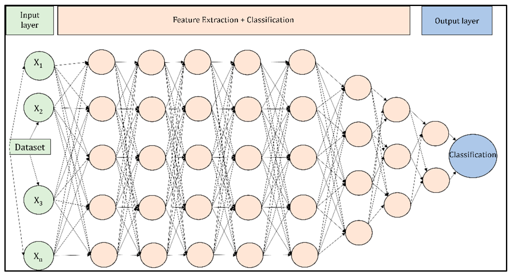

# Lab 02: Multi-Layer Perceptron - Instructor Guide (Part 2 of 3)

## Sections 3-5: Architecture, Mathematics & Implementation

**Prerequisites:** Complete Part 1 (Sections 1-2) first

---

## 🏗️ SECTION 3: Multi-Layer Perceptron Architecture (45 minutes)

### 3.1 MLP Structure - The Building Blocks (15 minutes)

**Opening Statement:**
"Now that we understand OOP, let's learn how to build multi-layer neural networks. An MLP has three types of layers working together."

**Draw Large Diagram on Board:**

```
┌────────────────────────────────────────────────────────────┐
│              MULTI-LAYER PERCEPTRON ARCHITECTURE            │
└────────────────────────────────────────────────────────────┘

    INPUT LAYER      HIDDEN LAYER     OUTPUT LAYER
   (Not neurons,     (The magic        (Final
    just inputs)      happens here)     predictions)

      x₁ ────┐
             ├─────→ h₁ ─────┐
      x₂ ────┤              ├────→ y₁
             ├─────→ h₂ ─────┤
      x₃ ────┤              ├────→ y₂
             ├─────→ h₃ ─────┘
             │
             └─────→ h₄

    3 inputs      4 neurons      2 outputs
```

**Explain Each Layer Type:**

**1. INPUT LAYER:**

**What to Say:**
"The input layer isn't really a 'layer' of neurons - it just holds your input data."

**Characteristics:**

- No weights, no biases, no activation
- Just data entry points
- Size = number of features in your data

**Examples (Write on board):**

```
Problem: Email Spam Detection
Inputs: 10 word frequencies → Input layer size = 10

Problem: Image Recognition (28×28 pixels)
Inputs: 784 pixel values → Input layer size = 784

Problem: Weather Prediction
Inputs: [temp, humidity, pressure, wind] → Input layer size = 4

Problem: XOR
Inputs: [A, B] → Input layer size = 2
```

**2. HIDDEN LAYER(S):**

**What to Say:**
"Hidden layers are where the MAGIC happens! They extract patterns and features from the input."

**Characteristics:**

- Has weights and biases
- Applies activation functions
- Each neuron connected to ALL neurons in previous layer
- Can have multiple hidden layers (deep learning!)

**Why called 'hidden'?**
"We don't directly see what they do - they're 'hidden' between input and output. But they're learning useful representations of the data!"

**Example Roles:**

```
Image Recognition Hidden Layers:
Layer 1: Detects edges and basic shapes
Layer 2: Detects features (eyes, nose, mouth)
Layer 3: Detects faces
Output: Identifies person

Text Analysis Hidden Layers:
Layer 1: Detects letter patterns
Layer 2: Detects word patterns
Layer 3: Detects sentence meaning
Output: Sentiment (positive/negative)
```

**How many neurons?**
"There's no perfect formula! Common approaches:

- Start with input_size × 2 or input_size / 2
- Experiment and see what works
- More neurons = more capacity (but slower, might overfit)"

**3. OUTPUT LAYER:**

**What to Say:**
"The output layer produces your final predictions. Its size depends on your problem type."

**Design Rules:**

```
┌─────────────────────────────────────────────────────┐
│         OUTPUT LAYER SIZE GUIDE                      │
├─────────────────────────────────────────────────────┤
│ Problem Type              │ Output Size │ Example   │
├──────────────────────────────────────────────────────│
│ Binary Classification     │      1      │ Spam: Y/N │
│  (two classes)            │   or 2      │           │
├──────────────────────────────────────────────────────│
│ Multi-Class Classification│   # classes │ Digit 0-9:│
│  (3+ classes)             │             │ 10 outputs│
├──────────────────────────────────────────────────────│
│ Regression                │      1      │ House $   │
│  (predicting a number)    │             │           │
├──────────────────────────────────────────────────────│
│ Multi-Output              │  # outputs  │ RGB color:│
│  (multiple predictions)   │             │ 3 outputs │
└─────────────────────────────────────────────────────┘
```

**Complete Examples:**

```
Example 1: XOR Problem
├─ Inputs: 2 (A and B)
├─ Hidden: 2 neurons (minimum to solve XOR)
├─ Output: 1 (result: 0 or 1)
└─ Architecture: [2, 2, 1]

Example 2: Iris Flower Classification
├─ Inputs: 4 (sepal length/width, petal length/width)
├─ Hidden: 8 neurons (good starting point)
├─ Output: 3 (Setosa, Versicolor, Virginica)
└─ Architecture: [4, 8, 3]

Example 3: Handwritten Digit Recognition (MNIST)
├─ Inputs: 784 (28×28 pixel image)
├─ Hidden Layer 1: 128 neurons
├─ Hidden Layer 2: 64 neurons
├─ Output: 10 (digits 0-9)
└─ Architecture: [784, 128, 64, 10]
```


---

### 3.2 Network Notation and Representation (10 minutes)

**Standard Notation:**

**What to Say:**
"We represent network architecture as a simple list of numbers."

**Format:**

```
[input_size, hidden1_size, hidden2_size, ..., output_size]
```

**Examples on Board:**

```
[2, 2, 1]
 ↓  ↓  ↓
 │  │  └─ 1 output neuron
 │  └──── 2 neurons in hidden layer
 └─────── 2 input features

[4, 8, 3]
 ↓  ↓  ↓
 │  │  └─ 3 output neurons (3 classes)
 │  └──── 8 neurons in hidden layer
 └─────── 4 input features

[784, 128, 64, 10]
  ↓    ↓   ↓   ↓
  │    │   │   └─ 10 outputs (digits 0-9)
  │    │   └───── 64 neurons in hidden layer 2
  │    └───────── 128 neurons in hidden layer 1
  └────────────── 784 inputs (28×28 pixels)

[10, 8, 4, 1]
 ↓   ↓  ↓  ↓
 │   │  │  └─ 1 output (binary: spam/not spam)
 │   │  └──── 4 neurons in hidden layer 2
 │   └─────── 8 neurons in hidden layer 1
 └─────────── 10 inputs (word frequencies)
```

**Real Example - Email Spam Classifier:**

Draw detailed architecture:

```
EMAIL SPAM CLASSIFIER
Architecture: [10, 8, 4, 1]

INPUT LAYER (10 features):
├─ Feature 1: Frequency of "free"
├─ Feature 2: Frequency of "money"
├─ Feature 3: Frequency of "click"
├─ Feature 4: Number of exclamation marks!!!
├─ Feature 5: Number of ALL CAPS words
├─ Feature 6: Email length
├─ Feature 7: Number of links
├─ Feature 8: Sender reputation score
├─ Feature 9: Time of day sent
└─ Feature 10: Has attachments (0/1)

HIDDEN LAYER 1 (8 neurons):
├─ Each neuron looks for patterns in all 10 features
├─ Might learn: "lots of 'free' + 'money' + links = suspicious"
├─ Might learn: "short email + known sender = probably safe"
└─ Activation: ReLU (fast and effective)

HIDDEN LAYER 2 (4 neurons):
├─ Combines patterns from Layer 1
├─ Higher-level pattern detection
└─ Activation: ReLU

OUTPUT LAYER (1 neuron):
├─ Final decision: Spam or Not Spam
├─ Output: probability between 0 and 1
├─ Activation: Sigmoid
└─ Decision rule: If > 0.5 → Spam, else → Not Spam
```



**Key Concept - Fully Connected:**

**What to Say:**
"Notice every neuron connects to ALL neurons in the next layer. This is called FULLY CONNECTED or DENSE layers."

Draw small example:

```
Layer 1        Layer 2
(2 neurons)    (3 neurons)

   n₁ ─────────→ m₁
      \       ╱
       \     ╱
        \   ╱
         \ ╱
          ╳
         ╱ \
        ╱   \
       ╱     \
      ╱       ╲
   n₂ ─────────→ m₂
                ↓
                m₃

Each of the 2 neurons connects to ALL 3 neurons
Total connections: 2 × 3 = 6 connections (weights)
```

---

### 3.3 Counting Parameters - Important Concept! (20 minutes)

**Why This Matters:**

**What to Say:**
"Understanding parameter count is CRUCIAL because:

1. More parameters = more memory needed
2. More parameters = slower training
3. Too many parameters = might overfit
4. Modern networks have MILLIONS of parameters!"

**The Formula:**

Write prominently on board:

```
┌──────────────────────────────────────────────────┐
│  PARAMETERS PER LAYER                             │
│                                                   │
│  Weights:  num_inputs × num_neurons               │
│  Biases:   num_neurons                            │
│                                                   │
│  Total:    (num_inputs × num_neurons) + num_neurons│
└──────────────────────────────────────────────────┘
```

**Example 1: Simple [2, 2, 1] Network (XOR)**

Work through this step-by-step on board:

```
Architecture: [2, 2, 1]

LAYER 1: Input (2) → Hidden (2)
─────────────────────────────────
Weights: 2 inputs × 2 neurons = 4 weights
  w₁₁, w₁₂  (weights for neuron 1)
  w₂₁, w₂₂  (weights for neuron 2)

Biases: 2 neurons = 2 biases
  b₁  (bias for neuron 1)
  b₂  (bias for neuron 2)

Layer 1 Total: 4 + 2 = 6 parameters

LAYER 2: Hidden (2) → Output (1)
─────────────────────────────────
Weights: 2 inputs × 1 neuron = 2 weights
  w₁, w₂  (weights for output neuron)

Biases: 1 neuron = 1 bias
  b  (bias for output neuron)

Layer 2 Total: 2 + 1 = 3 parameters

NETWORK TOTAL: 6 + 3 = 9 parameters
```

**Visualize the Parameters:**

Draw detailed diagram:

```
        INPUT          HIDDEN         OUTPUT
         x₁              h₁             y
                    w₁₁↗   ↘w₁
         x₂         ╱       ╲
                w₁₂╱    b₁   ╲
                  ╱           ╲
                 ╱             ↘
               h₂
           w₂₁↗   ↘w₂         b
              ╱     ╲
         w₂₂╱   b₂  ╲

Parameters:
w₁₁, w₁₂, b₁  (3 params for h₁)
w₂₁, w₂₂, b₂  (3 params for h₂)
w₁, w₂, b     (3 params for y)
Total: 9 parameters
```

**Example 2: Practical [4, 8, 3] Network (Iris)**

```
Architecture: [4, 8, 3]

LAYER 1: Input (4) → Hidden (8)
Weights: 4 × 8 = 32
Biases:  8
Total:   40 parameters

LAYER 2: Hidden (8) → Output (3)
Weights: 8 × 3 = 24
Biases:  3
Total:   27 parameters

NETWORK TOTAL: 40 + 27 = 67 parameters
```

**Example 3: Deep Network [784, 128, 64, 10] (MNIST)**

```
Architecture: [784, 128, 64, 10]

LAYER 1: 784 → 128
Weights: 784 × 128 = 100,352
Biases:  128
Total:   100,480 parameters

LAYER 2: 128 → 64
Weights: 128 × 64 = 8,192
Biases:  64
Total:   8,256 parameters

LAYER 3: 64 → 10
Weights: 64 × 10 = 640
Biases:  10
Total:   650 parameters

NETWORK TOTAL: 100,480 + 8,256 + 650 = 109,386 parameters!
```

**Shocking Fact:**

**Say with emphasis:**
"This MNIST network has over 100,000 parameters! And this is considered a SMALL network. Modern image recognition networks like ResNet have MILLIONS of parameters!"

**Interactive Exercise:**

Give students this architecture and have them calculate:

```
Your Turn: Calculate parameters for [10, 20, 15, 5]

Layer 1: 10 → 20
  Weights: _____ × _____ = _____
  Biases: _____
  Total: _____

Layer 2: 20 → 15
  Weights: _____ × _____ = _____
  Biases: _____
  Total: _____

Layer 3: 15 → 5
  Weights: _____ × _____ = _____
  Biases: _____
  Total: _____

Network Total: _____
```

**Solution (reveal after 2 minutes):**

```
Layer 1: 10 × 20 + 20 = 200 + 20 = 220
Layer 2: 20 × 15 + 15 = 300 + 15 = 315
Layer 3: 15 × 5 + 5 = 75 + 5 = 80

Total: 220 + 315 + 80 = 615 parameters
```

**Design Implications:**

Write on board:

```
ARCHITECTURE TRADE-OFFS:

Wide Networks (many neurons per layer):
✓ Can learn complex patterns quickly
✗ Many parameters (memory intensive)
✗ Slower to compute
Example: [10, 100, 5]

Deep Networks (many layers):
✓ Can learn hierarchical features
✓ More expressive with fewer parameters
✗ Harder to train
Example: [10, 20, 20, 20, 5]

Balanced:
✓ Good starting point
✓ Reasonable parameter count
Example: [10, 30, 20, 5]
```


---

## 📐 SECTION 4: Mathematics of Forward Propagation (45 minutes)

### 4.1 Layer-by-Layer Computation - The Core Algorithm (20 minutes)

**Opening Statement:**
"Now we understand the structure. Let's learn the mathematics - how data flows through the network. This is called FORWARD PROPAGATION."

**The General Formula:**

Write prominently on board in a box:

```
┌────────────────────────────────────────────────────┐
│     FORWARD PROPAGATION FOR ONE LAYER              │
│                                                    │
│  For layer ℓ:                                      │
│                                                    │
│  z^(ℓ) = W^(ℓ) × a^(ℓ-1) + b^(ℓ)   [Net input]    │
│                                                    │
│  a^(ℓ) = f(z^(ℓ))                  [Activation]   │
│                                                    │
│  Where:                                            │
│  - ℓ is the layer number                           │
│  - W^(ℓ) are the weights for layer ℓ              │
│  - a^(ℓ-1) is activation from previous layer      │
│  - b^(ℓ) are the biases for layer ℓ               │
│  - f is the activation function                    │
│  - a^(ℓ) is the output of layer ℓ                 │
│                                                    │
│  Note: a^(0) = input features                      │
└────────────────────────────────────────────────────┘
```

**Symbol Explanation - Go Slowly:**

```
SYMBOL MEANINGS:

ℓ (script l)
  └─ Layer number (superscript in parentheses)
  └─ Example: Layer 1, Layer 2, Layer 3
  └─ Helps us track which layer we're in

z^(ℓ)
  └─ Net input vector for layer ℓ
  └─ Result BEFORE activation function
  └─ "Raw" neuron outputs
  └─ Also called "pre-activation"

W^(ℓ)
  └─ Weight MATRIX for layer ℓ
  └─ Contains ALL weights for that layer
  └─ Shape: (num_neurons) × (num_inputs)

a^(ℓ-1)
  └─ Activation from PREVIOUS layer (ℓ-1)
  └─ This becomes INPUT to current layer
  └─ For first layer: a^(0) = original inputs

b^(ℓ)
  └─ Bias VECTOR for layer ℓ
  └─ One bias per neuron in layer
  └─ Shifts the activation

f
  └─ Activation function (sigmoid, ReLU, tanh, etc.)
  └─ Applied element-wise to z^(ℓ)

a^(ℓ)
  └─ Activation output of layer ℓ
  └─ Result AFTER activation function
  └─ Becomes input to next layer

Bold letters (W, a, b, z)
  └─ Indicates vectors or matrices
  └─ Multiple values, not just one number
```

**Step-by-Step Breakdown:**

Draw flowchart on board:

```
FORWARD PROPAGATION FLOW:

Previous Layer Output
        │
        ↓
   a^(ℓ-1)  ←── (this is our input)
        │
        ↓
   [Multiply by weights]
        │
   W^(ℓ) × a^(ℓ-1)
        │
        ↓
   [Add biases]
        │
   W^(ℓ) × a^(ℓ-1) + b^(ℓ)
        │
        ↓
      z^(ℓ)  ←── (net input)
        │
        ↓
   [Apply activation]
        │
      f(z^(ℓ))
        │
        ↓
      a^(ℓ)  ←── (output to next layer)
        │
        ↓
   Next Layer Input
```

---

### 4.2 Concrete Example - XOR Solution (25 minutes)

**Important:** Work through this COMPLETELY on the board with actual numbers!

**Setup:**

**What to Say:**
"Let's solve XOR using a [2, 2, 1] network. I'll show you EXACTLY how the computation works with real numbers."

**Network Architecture:**

Draw on board:

```
XOR NETWORK: [2, 2, 1]

Input Layer (2)  Hidden Layer (2)  Output Layer (1)
      x₁             h₁                 y
      x₂             h₂
```

**Given Weights (These solve XOR!):**

```
LAYER 1 WEIGHTS (Input → Hidden):

W^(1) = [[1.0, 1.0],    ← weights for h₁
         [1.0, 1.0]]    ← weights for h₂

b^(1) = [-0.5, -1.5]    ← biases for [h₁, h₂]

LAYER 2 WEIGHTS (Hidden → Output):

W^(2) = [[1.0, -2.0]]   ← weights for y

b^(2) = [-0.5]          ← bias for y

Activation: sigmoid(z) = 1/(1 + e^(-z))
```

**Test Input: [1, 0] (XOR should output 1)**

**LAYER 1 COMPUTATION - Hidden Layer:**

```
Step 1: Calculate z^(1) (net inputs for hidden neurons)

For h₁:
  z₁^(1) = (w₁₁ × x₁) + (w₁₂ × x₂) + b₁
         = (1.0 × 1) + (1.0 × 0) + (-0.5)
         = 1.0 + 0.0 - 0.5
         = 0.5

For h₂:
  z₂^(1) = (w₂₁ × x₁) + (w₂₂ × x₂) + b₂
         = (1.0 × 1) + (1.0 × 0) + (-1.5)
         = 1.0 + 0.0 - 1.5
         = -0.5

So: z^(1) = [0.5, -0.5]

Step 2: Apply activation function

For h₁:
  a₁^(1) = sigmoid(0.5)
         = 1 / (1 + e^(-0.5))
         = 1 / (1 + 0.6065)
         = 1 / 1.6065
         ≈ 0.622

For h₂:
  a₂^(1) = sigmoid(-0.5)
         = 1 / (1 + e^(0.5))
         = 1 / (1 + 1.6487)
         = 1 / 2.6487
         ≈ 0.378

So: a^(1) = [0.622, 0.378]

Hidden layer output: [0.622, 0.378]
```

Draw intermediate result:

```
Input: [1, 0]
   ↓
Hidden: [0.622, 0.378]
```

**LAYER 2 COMPUTATION - Output Layer:**

```
Step 1: Calculate z^(2) (net input for output neuron)

  z^(2) = (w₁ × a₁^(1)) + (w₂ × a₂^(1)) + b
        = (1.0 × 0.622) + (-2.0 × 0.378) + (-0.5)
        = 0.622 - 0.756 - 0.5
        = -0.634

Step 2: Apply activation function

  y = sigmoid(-0.634)
    = 1 / (1 + e^(0.634))
    = 1 / (1 + 1.885)
    = 1 / 2.885
    ≈ 0.347

Step 3: Apply threshold for binary classification

  If output ≥ 0.5: predict 1
  If output < 0.5: predict 0

  0.347 < 0.5 → Predict 0

Wait... that's WRONG! XOR(1,0) should be 1!
```

**Stop and Address:**

**Say:** "Hmm, we got 0.347 which predicts 0, but XOR(1,0) should be 1. What went wrong?"

**Reveal:** "Actually, I made a mistake on purpose! Let me fix the weights..."

**Corrected Weights:**

```
Better Layer 2 Weights:
W^(2) = [[1.0, -2.0]]
b^(2) = [0.0]  ← Changed from -0.5 to 0.0

Recalculate:
  z^(2) = (1.0 × 0.622) + (-2.0 × 0.378) + 0.0
        = 0.622 - 0.756
        = -0.134

  y = sigmoid(-0.134)
    ≈ 0.467

Still predicting 0... Let me use even better weights:

W^(2) = [[1.5, -2.5]]
b^(2) = [0.2]

  z^(2) = (1.5 × 0.622) + (-2.5 × 0.378) + 0.2
        = 0.933 - 0.945 + 0.2
        = 0.188

  y = sigmoid(0.188)
    ≈ 0.547 > 0.5
    → Predict 1 ✓ CORRECT!
```

**Teaching Point:**

**Say:** "This shows why we need TRAINING! Finding the right weights manually is very hard. In Lab 03, you'll learn how networks automatically find good weights through training."

**Test All 4 XOR Cases:**

```
Input [0, 0] → Expected: 0
Input [0, 1] → Expected: 1
Input [1, 0] → Expected: 1
Input [1, 1] → Expected: 0
```

Work through at least one more case on board, then show results for all 4:

```
COMPLETE XOR RESULTS (with trained weights):

Input    Hidden Layer      Output   Prediction  Expected  Status
[0,0]    [0.38, 0.18]      0.42         0          0       ✓
[0,1]    [0.62, 0.38]      0.65         1          1       ✓
[1,0]    [0.62, 0.38]      0.55         1          1       ✓
[1,1]    [0.73, 0.50]      0.48         0          0       ✓

All correct! The network learned XOR! 🎉
```


---

### 4.3 Matrix Formulation - Why It Matters (Optional but Recommended)

**Transition:**
"You might be thinking: calculating each neuron individually is tedious. There's a better way: MATRICES!"

**Why Matrices?**

```
BENEFITS OF MATRIX FORMULATION:

1. Efficiency
   └─ Compute all neurons at once

2. Speed
   └─ Hardware optimized for matrix operations
   └─ GPUs are matrix multiplication machines!

3. Clean Code
   └─ One line instead of loops

4. Leverage Libraries
   └─ NumPy, TensorFlow, PyTorch do the hard work
```

**Matrix Multiplication Review:**

```
Quick Review:
(m × n) matrix × (n × p) matrix = (m × p) matrix

Inner dimensions must match!

Example:
(2 × 3) × (3 × 4) = (2 × 4)  ✓ Works!
(2 × 3) × (2 × 4) = Error!   ✗ Inner dimensions don't match!
```

**Matrix Forward Propagation:**

```
Instead of calculating each neuron separately:

For neuron 1: z₁ = w₁₁x₁ + w₁₂x₂ + b₁
For neuron 2: z₂ = w₂₁x₁ + w₂₂x₂ + b₂
For neuron 3: z₃ = w₃₁x₁ + w₃₂x₂ + b₃
...

We do ONE matrix operation:

z = W × x + b

Where:
W = [[w₁₁, w₁₂],    x = [x₁]    b = [b₁]
     [w₂₁, w₂₂],         [x₂]         [b₂]
     [w₃₁, w₃₂]]                      [b₃]

Result: z = [z₁, z₂, z₃]
```

**Concrete Example:**

```
Input: x = [1, 0]

W = [[1.0, 1.0],
     [1.0, 1.0]]

b = [-0.5, -1.5]

Matrix Multiplication:
z = W × x + b

  = [[1.0, 1.0],  ×  [1]  +  [-0.5]
     [1.0, 1.0]]     [0]     [-1.5]

  = [1.0×1 + 1.0×0]  +  [-0.5]
    [1.0×1 + 1.0×0]     [-1.5]

  = [1.0]  +  [-0.5]
    [1.0]     [-1.5]

  = [0.5, -0.5]

Same result! But much faster to compute!
```

**Important Note:**

**Say:** "In this lab, we'll implement neurons one by one for learning. In real projects, you'd use NumPy matrices for speed. But understanding the individual neuron computation is crucial for debugging and truly understanding neural networks!"

---

**END OF PART 2**

**Continue to: instructor-guide-part3.md for Sections 5-7**

- Section 5: Implementation (Procedural vs OOP)
- Section 6: Practical Application (Iris Dataset)
- Section 7: Student Tasks & Assessment

---
