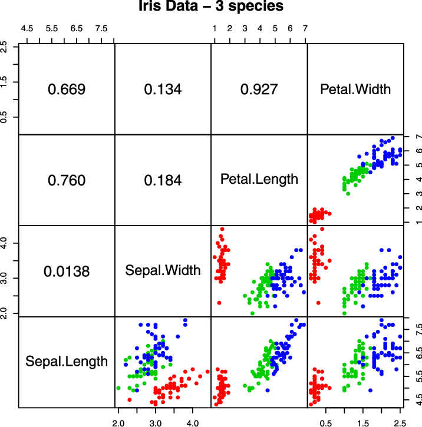

# Lab 02: Multi-Layer Perceptron - Instructor Guide (Part 3 of 3)

## Sections 5-7: Implementation, Application & Assessment

**Prerequisites:** Complete Parts 1 & 2 first

---

## 💻 SECTION 5: Implementation (60 minutes)

**Critical Teaching Strategy:** Show BOTH approaches side-by-side to emphasize OOP benefits!

### 5.1 Without OOP - The Procedural Approach (20 minutes)

**Opening Statement:**
"Let's implement a [2, 2, 1] XOR network WITHOUT OOP first. Watch how messy it gets!"

**Complete Procedural Code - Type This Live:**

```python
"""
XOR Network WITHOUT OOP - The Messy Way
"""
import math

# ============================================================================
# GLOBAL VARIABLES - Weights and Biases (scattered everywhere!)
# ============================================================================

# Layer 1: Input → Hidden (2 inputs, 2 neurons)
weights_hidden_layer = [
    [1.0, 1.0],  # Weights for first hidden neuron
    [1.0, 1.0]   # Weights for second hidden neuron
]
biases_hidden_layer = [-0.5, -1.5]

# Layer 2: Hidden → Output (2 inputs, 1 neuron)
weights_output_layer = [1.5, -2.5]
bias_output_layer = 0.2


# ============================================================================
# ACTIVATION FUNCTIONS
# ============================================================================

def sigmoid(z):
    """Sigmoid activation function."""
    return 1 / (1 + math.exp(-z))


# ============================================================================
# LAYER FORWARD FUNCTIONS (need separate function for each layer!)
# ============================================================================

def forward_hidden_layer(inputs, weights, biases):
    """
    Calculate hidden layer output - procedural way.

    Problems:
    - Need to pass weights and biases as parameters
    - Easy to use wrong variables
    - Hard to add more layers
    """
    outputs = []

    for i in range(len(weights)):
        # Calculate weighted sum for this neuron
        z = 0
        for j in range(len(inputs)):
            z += weights[i][j] * inputs[j]
        z += biases[i]

        # Apply activation
        a = sigmoid(z)
        outputs.append(a)

    return outputs


def forward_output_layer(inputs, weights, bias):
    """
    Calculate output layer - procedural way.

    Problems:
    - Different function signature than hidden layer
    - Inconsistent interface
    - Code duplication
    """
    z = 0
    for i in range(len(inputs)):
        z += weights[i] * inputs[i]
    z += bias

    return sigmoid(z)


def predict(inputs):
    """
    Full network prediction - procedural way.

    Problems:
    - Must manually manage layer sequence
    - Hard to insert new layers
    - Relies on global variables (dangerous!)
    """
    # Forward through hidden layer
    hidden = forward_hidden_layer(
        inputs,
        weights_hidden_layer,  # Easy to forget or mix up!
        biases_hidden_layer
    )

    # Forward through output layer
    output = forward_output_layer(
        hidden,
        weights_output_layer,
        bias_output_layer
    )

    return output


# ============================================================================
# TESTING XOR
# ============================================================================

print("=" * 70)
print("XOR NETWORK - PROCEDURAL APPROACH")
print("=" * 70)

xor_inputs = [[0, 0], [0, 1], [1, 0], [1, 1]]
xor_expected = [0, 1, 1, 0]

print("\nTesting XOR:")
for i, inputs in enumerate(xor_inputs):
    output = predict(inputs)
    prediction = 1 if output >= 0.5 else 0
    status = "✓" if prediction == xor_expected[i] else "✗"
    print(f"Input: {inputs} → Output: {output:.4f} → "
          f"Prediction: {prediction} (Expected: {xor_expected[i]}) {status}")
```

**Run the code, then highlight problems on board:**

```
❌ PROBLEMS WITH PROCEDURAL APPROACH:

1. Global Variables Everywhere
   └─ weights_hidden_layer, biases_hidden_layer, etc.
   └─ Hard to manage, easy to use wrong variable
   └─ What if we have 10 layers?

2. Separate Functions for Each Layer
   └─ forward_hidden_layer() vs forward_output_layer()
   └─ Code duplication
   └─ Inconsistent interfaces

3. Parameter Passing Nightmare
   └─ forward_hidden_layer(inputs, weights, biases)
   └─ Easy to mix up parameter order
   └─ Lots of typing, error-prone

4. Hard to Scale
   └─ Want to add layer? Rewrite everything!
   └─ Want different architecture? Start over!

5. No Encapsulation
   └─ All weights exposed globally
   └─ Accidental modification possible
   └─ No organization

6. Testing Difficulty
   └─ Can't easily test individual layers
   └─ Global state makes bugs hard to track

Imagine doing this for [784, 128, 64, 10]... 😱
```

**Pause and say:**
"This is exactly why we need OOP! Let me show you the elegant solution..."

---

### 5.2 With OOP - The Professional Approach (40 minutes)

**Opening Statement:**
"Now watch how OOP transforms this mess into clean, professional code!"

**Part A - The Layer Class (15 minutes)**

**Type this live and explain each part:**

```python
"""
XOR Network WITH OOP - The Professional Way
"""
import math
import random


class Layer:
    """
    Represents one layer in a neural network.

    Encapsulates:
    - Weights and biases for this layer
    - Forward propagation logic
    - Activation function

    Benefits:
    - Self-contained (manages its own data)
    - Reusable (use for any layer)
    - Easy to test independently
    """

    def __init__(self, num_inputs, num_neurons, activation='sigmoid'):
        """
        Initialize a layer.

        Parameters:
            num_inputs: Number of inputs to this layer
            num_neurons: Number of neurons in this layer
            activation: Activation function name
        """
        self.num_inputs = num_inputs
        self.num_neurons = num_neurons
        self.activation = activation

        # Initialize weights: one list per neuron
        # Each neuron has num_inputs weights
        self.weights = []
        for i in range(num_neurons):
            neuron_weights = []
            for j in range(num_inputs):
                # Small random values (better than zeros)
                weight = random.uniform(-1, 1)
                neuron_weights.append(weight)
            self.weights.append(neuron_weights)

        # Initialize biases: one per neuron
        self.biases = []
        for i in range(num_neurons):
            bias = random.uniform(-1, 1)
            self.biases.append(bias)

        print(f"  ✓ Layer created: {num_inputs} inputs → "
              f"{num_neurons} neurons ({activation})")

    def set_weights(self, weights, biases):
        """
        Manually set weights and biases (useful for testing).

        Parameters:
            weights: List of weight lists (one per neuron)
            biases: List of biases (one per neuron)
        """
        self.weights = weights
        self.biases = biases
        print(f"  ✓ Weights set manually for {self.num_neurons} neurons")

    def forward(self, inputs):
        """
        Forward propagation through this layer.

        Parameters:
            inputs: List of input values

        Returns:
            List of activated outputs
        """
        outputs = []

        # Calculate output for each neuron
        for i in range(self.num_neurons):
            # Step 1: Calculate weighted sum
            z = 0
            for j in range(self.num_inputs):
                z += self.weights[i][j] * inputs[j]
            z += self.biases[i]

            # Step 2: Apply activation function
            if self.activation == 'sigmoid':
                a = 1 / (1 + math.exp(-z))
            elif self.activation == 'relu':
                a = max(0, z)
            elif self.activation == 'tanh':
                a = math.tanh(z)
            else:  # linear (no activation)
                a = z

            outputs.append(a)

        return outputs

    def __repr__(self):
        """String representation for printing."""
        return (f"Layer({self.num_inputs}→{self.num_neurons}, "
                f"{self.activation})")
```

**Stop and explain the benefits:**

```
✓ BENEFITS OF LAYER CLASS:

1. Encapsulation
   └─ All layer data (weights, biases) stored together
   └─ Can't accidentally use wrong layer's weights

2. Reusability
   └─ Write once, use for ALL layers
   └─ Hidden layer? Use Layer class.
   └─ Output layer? Use Layer class.

3. Flexibility
   └─ Easy to change activation function
   └─ Easy to change layer size

4. Testability
   └─ Can test one layer independently
   └─ layer.forward([1, 0]) → see output

5. Clean Interface
   └─ Simple to use: layer.forward(inputs)
   └─ Don't need to pass weights/biases
```

**Quick Test:**

```python
# Create and test one layer
print("\n--- Testing Single Layer ---")
test_layer = Layer(2, 3, 'sigmoid')
test_layer.set_weights(
    [[1.0, 1.0], [0.5, -0.5], [2.0, 1.0]],
    [0, 0, -1]
)

output = test_layer.forward([1, 0])
print(f"Input: [1, 0]")
print(f"Output: {[f'{x:.3f}' for x in output]}")
```

**Part B - The MLP Class (15 minutes)**

**Type this live:**

```python
class MLP:
    """
    Multi-Layer Perceptron - A feedforward neural network.

    Manages multiple layers and coordinates forward propagation.

    Benefits:
    - Easy to create networks of any architecture
    - Clean prediction interface
    - Automatic layer management
    """

    def __init__(self, architecture, activation='sigmoid'):
        """
        Initialize an MLP.

        Parameters:
            architecture: List of layer sizes
                         [input_size, hidden1, hidden2, ..., output_size]
            activation: Default activation for all layers

        Example:
            MLP([2, 4, 3, 1]) creates:
            - Input: 2 features
            - Hidden layer 1: 4 neurons
            - Hidden layer 2: 3 neurons
            - Output: 1 neuron
        """
        self.architecture = architecture
        self.layers = []

        # Create all layers automatically!
        for i in range(len(architecture) - 1):
            num_inputs = architecture[i]
            num_neurons = architecture[i + 1]

            layer = Layer(num_inputs, num_neurons, activation)
            self.layers.append(layer)

        print(f"\n✓ MLP created with architecture {architecture}")
        print(f"  Total layers: {len(self.layers)}")

    def forward(self, inputs):
        """
        Forward propagation through entire network.

        Parameters:
            inputs: List of input features

        Returns:
            List of output predictions
        """
        # Start with input features
        activation = inputs

        # Pass through each layer sequentially
        for layer in self.layers:
            activation = layer.forward(activation)

        # Final activation is the output
        return activation

    def predict(self, inputs):
        """
        Make a prediction.

        This is just an alias for forward() for clarity.
        """
        return self.forward(inputs)

    def predict_binary(self, inputs, threshold=0.5):
        """
        Make binary prediction (for classification).

        Parameters:
            inputs: Input features
            threshold: Decision threshold

        Returns:
            0 or 1
        """
        output = self.predict(inputs)[0]  # Get first output neuron
        return 1 if output >= threshold else 0

    def predict_class(self, inputs):
        """
        Multi-class prediction (returns index of highest output).

        Parameters:
            inputs: Input features

        Returns:
            Class index (0, 1, 2, ...)
        """
        outputs = self.predict(inputs)
        # Find index of maximum value
        max_value = max(outputs)
        return outputs.index(max_value)

    def predict_detailed(self, inputs):
        """
        Make prediction and show all intermediate values.
        (Useful for debugging and teaching!)
        """
        print(f"\n{'=' * 60}")
        print(f"DETAILED FORWARD PROPAGATION")
        print(f"{'=' * 60}")
        print(f"Input: {inputs}")

        activation = inputs

        for i, layer in enumerate(self.layers):
            print(f"\n--- Layer {i+1}: {layer} ---")
            print(f"Input:  {[f'{x:.4f}' for x in activation]}")

            activation = layer.forward(activation)

            print(f"Output: {[f'{x:.4f}' for x in activation]}")

        print(f"\n{'=' * 60}")
        print(f"Final Output: {[f'{x:.4f}' for x in activation]}")
        print(f"{'=' * 60}\n")

        return activation

    def get_info(self):
        """Display network information."""
        print(f"\nNetwork Architecture: {self.architecture}")
        print(f"Number of layers: {len(self.layers)}")

        # Calculate total parameters
        total_params = 0
        for i, layer in enumerate(self.layers):
            layer_params = (layer.num_inputs * layer.num_neurons +
                          layer.num_neurons)
            total_params += layer_params
            print(f"  Layer {i+1}: {layer_params} parameters")

        print(f"Total parameters: {total_params}")
```

**Stop and highlight the elegance:**

```
✓ MLP CLASS BENEFITS:

1. Simple Creation
   └─ MLP([2, 4, 1]) → Done!
   └─ Automatically creates all layers

2. Easy to Modify
   └─ Change to [2, 8, 8, 1]? Just change the list!
   └─ Add layers? Remove layers? Easy!

3. Clean Interface
   └─ network.predict([1, 0]) → Clean!
   └─ No need to manage layers manually

4. Automatic Propagation
   └─ Forward pass handled automatically
   └─ Loops through all layers

5. Useful Methods
   └─ predict_binary() for classification
   └─ predict_class() for multi-class
   └─ predict_detailed() for debugging

6. Network Information
   └─ get_info() shows architecture
   └─ Calculates parameter count automatically
```

**Part C - Complete XOR Example (10 minutes)**

**Type and run this complete example:**

```python
print("\n" + "="*70)
print("XOR NETWORK - OOP APPROACH")
print("="*70)

# Create XOR network
xor_network = MLP([2, 2, 1], activation='sigmoid')

# Set the weights that solve XOR
xor_network.layers[0].set_weights(
    [[1.0, 1.0], [1.0, 1.0]],  # Hidden layer weights
    [-0.5, -1.5]                # Hidden layer biases
)
xor_network.layers[1].set_weights(
    [[1.5, -2.5]],              # Output layer weights
    [0.2]                       # Output layer bias
)

# Test XOR
print("\n--- Testing XOR ---")
xor_inputs = [[0, 0], [0, 1], [1, 0], [1, 1]]
xor_expected = [0, 1, 1, 0]

for i, inputs in enumerate(xor_inputs):
    output = xor_network.predict(inputs)[0]
    prediction = 1 if output >= 0.5 else 0
    status = "✓" if prediction == xor_expected[i] else "✗"
    print(f"  {inputs} → {output:.4f} → {prediction} "
          f"(expected {xor_expected[i]}) {status}")

# Show detailed prediction for one case
print("\n" + "-"*70)
print("Detailed prediction for [1, 0]:")
xor_network.predict_detailed([1, 0])

# Show network info
xor_network.get_info()
```

**Compare Side-by-Side on Board:**

```
┌─────────────────────────────────────────────────────────────┐
│              PROCEDURAL vs OOP COMPARISON                    │
├─────────────────────────────────────────────────────────────┤
│                                                             │
│ PROCEDURAL:                    OOP:                         │
│                                                             │
│ weights_layer1 = [...]         network = MLP([2, 2, 1])    │
│ biases_layer1 = [...]                                       │
│ weights_layer2 = [...]         network.predict([1, 0])     │
│ biases_layer2 = [...]                                       │
│                                ✓ Clean!                     │
│ hidden = forward_layer1(       ✓ Professional!             │
│   inputs,                       ✓ Reusable!                 │
│   weights_layer1,                                           │
│   biases_layer1                                             │
│ )                                                           │
│                                                             │
│ output = forward_layer2(                                    │
│   hidden,                                                   │
│   weights_layer2,                                           │
│   biases_layer2                                             │
│ )                                                           │
│                                                             │
│ ❌ Messy!                                                    │
│ ❌ Error-prone!                                              │
│ ❌ Hard to scale!                                            │
│                                                             │
└─────────────────────────────────────────────────────────────┘
```

**Final Statement:**
"This is the power of OOP! From chaos to elegance. Now let's apply this to real problems!"

---

## 🎯 SECTION 6: Practical Application - Iris Dataset (45 minutes)

### 6.1 Problem Introduction (10 minutes)

**The Iris Dataset - A Classic:**

**What to Say:**
"Let's solve a REAL machine learning problem: classifying iris flowers by species!"

**Background:**

```
THE IRIS DATASET
================

History:
- Collected in 1936 by botanist Ronald Fisher
- One of the most famous ML datasets
- Used in virtually every ML course

The Data:
- 150 samples of iris flowers
- 3 species:
  * Setosa (سوسن)
  * Versicolor (متعدد الألوان)
  * Virginica (عذراء)
- 4 features per flower:
  * Sepal length (cm)
  * Sepal width (cm)
  * Petal length (cm)
  * Petal width (cm)

Why This Problem?
- Multi-class classification (3 classes)
- Real botanical data
- Manageable size
- Clear visual patterns
- Perfect for learning!
```

**Show Visual:**

Draw on board:

```
IRIS FLOWER PARTS:

        Petal
         ╱╲
        ╱  ╲
       ╱    ╲
    Sepal  Sepal
      │      │
      └──────┘
         │
       Stem

Sepal: Outer protective leaves (green)
Petal: Inner colorful leaves
```


**Sample Data:**

```
EXAMPLE SAMPLES:

Setosa (Class 0):
  Sepal: 5.1 cm long, 3.5 cm wide
  Petal: 1.4 cm long, 0.2 cm wide
  → Short petals, wide sepals

Versicolor (Class 1):
  Sepal: 7.0 cm long, 3.2 cm wide
  Petal: 4.7 cm long, 1.4 cm wide
  → Medium petals

Virginica (Class 2):
  Sepal: 6.3 cm long, 3.3 cm wide
  Petal: 6.0 cm long, 2.5 cm wide
  → Long petals

Pattern: Petal length is the key distinguishing feature!
```



---

### 6.2 Network Design (15 minutes)

**Architecture Decision:**

**What to Say:**
"Let's design a network for this problem. We need to make several decisions."

**Decision 1: Input Layer Size**

```
Question: How many inputs?
Answer: 4 (one per feature)

Features → Inputs:
- Sepal length → input 1
- Sepal width → input 2
- Petal length → input 3
- Petal width → input 4

Input layer size = 4
```

**Decision 2: Output Layer Size**

```
Question: How many outputs?
Answer: 3 (one per class)

Each output represents one species:
- Output 1 → Probability of Setosa
- Output 2 → Probability of Versicolor
- Output 3 → Probability of Virginica

Prediction: Choose class with highest output

Example:
Outputs: [0.1, 0.7, 0.2]
         ↓    ↑    ↓
      Setosa Versicolor Virginica
              (highest)

Prediction: Versicolor (class 1)
```

**Decision 3: Hidden Layer(s)**

**Interactive Discussion:**

**Ask students:** "How many hidden layers? How many neurons per layer?"

Wait for responses, then explain:

```
OPTIONS:

Option 1: [4, 3] - Direct from input to output
  Pros: Simple, few parameters
  Cons: Limited learning capacity

Option 2: [4, 8, 3] - One hidden layer
  Pros: Good balance, proven to work
  Cons: Might need more for complex patterns

Option 3: [4, 16, 8, 3] - Two hidden layers
  Pros: Can learn complex patterns
  Cons: More parameters, slower

For Iris (simple problem):
→ [4, 8, 3] is perfect!
  - 8 hidden neurons (double the inputs)
  - One hidden layer (sufficient)
  - 3 outputs (one per class)
```

**Decision 4: Activation Functions**

```
Hidden Layer:
- Use ReLU (Rectified Linear Unit)
- Why? Fast, effective, doesn't saturate
- Formula: ReLU(z) = max(0, z)
- Allows deep networks to train

Output Layer:
- Use Softmax
- Why? Converts outputs to probabilities
- Ensures outputs sum to 1
- Perfect for multi-class classification

Softmax Formula:
  softmax(z_i) = e^(z_i) / Σ(e^(z_j))

Example:
  Inputs: [2.0, 1.0, 0.5]
  Softmax: [0.659, 0.242, 0.099]
  Sum: 1.000 ✓
```

Draw network diagram:

```
IRIS CLASSIFICATION NETWORK
Architecture: [4, 8, 3]

     INPUT          HIDDEN         OUTPUT
      (4)            (8)            (3)

  sepal_len ─┐
  sepal_wid ─┤
  petal_len ─├────→ n₁ ──┐
  petal_wid ─┘      n₂ ──│
                    n₃ ──├──→ Setosa
                    n₄ ──│
                    n₅ ──├──→ Versicolor
                    n₆ ──│
                    n₇ ──├──→ Virginica
                    n₈ ──┘

  4 features    ReLU      Softmax
               activation  activation
```

**Parameter Count:**

```
Layer 1: 4 → 8
  Weights: 4 × 8 = 32
  Biases: 8
  Total: 40 parameters

Layer 2: 8 → 3
  Weights: 8 × 3 = 24
  Biases: 3
  Total: 27 parameters

Network Total: 40 + 27 = 67 parameters

(Manageable size - trains quickly!)
```

---

### 6.3 Implementation and Testing (20 minutes)

**Complete Working Code:**

```python
print("\n" + "="*70)
print("IRIS FLOWER CLASSIFICATION")
print("="*70)

# Sample iris data (simplified for demonstration)
iris_data = [
    # [sepal_len, sepal_wid, petal_len, petal_wid], species, class
    {"features": [5.1, 3.5, 1.4, 0.2], "species": "Setosa", "class": 0},
    {"features": [4.9, 3.0, 1.4, 0.2], "species": "Setosa", "class": 0},
    {"features": [4.7, 3.2, 1.3, 0.2], "species": "Setosa", "class": 0},

    {"features": [7.0, 3.2, 4.7, 1.4], "species": "Versicolor", "class": 1},
    {"features": [6.4, 3.2, 4.5, 1.5], "species": "Versicolor", "class": 1},
    {"features": [6.9, 3.1, 4.9, 1.5], "species": "Versicolor", "class": 1},

    {"features": [6.3, 3.3, 6.0, 2.5], "species": "Virginica", "class": 2},
    {"features": [5.8, 2.7, 5.1, 1.9], "species": "Virginica", "class": 2},
    {"features": [7.1, 3.0, 5.9, 2.1], "species": "Virginica", "class": 2},
]

# Create network
print("\nCreating Iris Classification Network...")
iris_network = MLP([4, 8, 3], activation='relu')

print("\n" + "-"*70)
print("IMPORTANT NOTE:")
print("-"*70)
print("This network has RANDOM weights (untrained).")
print("Predictions will be random!")
print("")
print("In Lab 03, you'll learn TRAINING:")
print("- How to adjust weights automatically")
print("- Using backpropagation algorithm")
print("- Minimizing prediction errors")
print("- Achieving high accuracy!")
print("-"*70)

# Make predictions with random weights (for demonstration)
print("\n--- Predictions with Random Weights ---")
print("(Just for demonstration - not trained!)\n")

species_names = ["Setosa", "Versicolor", "Virginica"]

for sample in iris_data:
    features = sample['features']
    true_class = sample['class']
    true_species = sample['species']

    # Get network outputs
    outputs = iris_network.predict(features)

    # Find predicted class (highest output)
    predicted_class = iris_network.predict_class(features)
    predicted_species = species_names[predicted_class]

    # Check if correct
    status = "✓" if predicted_class == true_class else "✗"

    print(f"Features: {features}")
    print(f"  Outputs: [{outputs[0]:.3f}, {outputs[1]:.3f}, {outputs[2]:.3f}]")
    print(f"  Predicted: {predicted_species} (class {predicted_class})")
    print(f"  Actual:    {true_species} (class {true_class}) {status}")
    print()

# Show one detailed prediction
print("\n" + "="*70)
print("DETAILED PREDICTION EXAMPLE")
print("="*70)
sample = iris_data[0]  # A Setosa sample
print(f"Sample: {sample['species']}")
print(f"Features: {sample['features']}")
iris_network.predict_detailed(sample['features'])

# Network information
iris_network.get_info()
```

**After running, discuss results:**

**What to Say:**
"Notice the predictions are RANDOM because we haven't trained the network! The accuracy might be around 33% (random guessing for 3 classes).

After training in Lab 03:

- Accuracy will improve to 95-98%
- Network learns which features matter
- Weights adjust to minimize errors
- Clear decision boundaries emerge

This demonstrates:
✓ We understand network STRUCTURE (Lab 02)
✗ We don't yet know network TRAINING (Lab 03)

Structure without training = random guessing
Structure WITH training = intelligent predictions"

**Key Teaching Point:**

Draw this progression:

```
LEARNING PROGRESSION:

Lab 01: Single Neuron
├─ Learned: Weighted sum + activation
├─ Limitation: Only linear problems
└─ Example: Water temperature

Lab 02: Multi-Layer Perceptron ← WE ARE HERE!
├─ Learned: Network architecture
├─ Learned: Forward propagation
├─ Learned: OOP implementation
├─ Limitation: Random weights
└─ Example: XOR, Iris (structure only)

Lab 03: Training Neural Networks ← NEXT!
├─ Will Learn: Backpropagation
├─ Will Learn: Gradient descent
├─ Will Learn: Loss functions
├─ Result: Networks that actually work!
└─ Example: Train Iris to 95%+ accuracy
```

---

## 📝 SECTION 7: Student Tasks and Assessment (30 minutes + homework)

### 7.1 Task Assignment (5 minutes)

**What to Say:**
"Now it's your turn! You'll complete three tasks that progressively build your skills. I'll be here to help if you get stuck."

**Hand Out or Show student-task.py**

**Task Overview on Board:**

```
┌─────────────────────────────────────────────────────┐
│            LAB 02 STUDENT TASKS                      │
├─────────────────────────────────────────────────────┤
│                                                     │
│ Task 1: Handwritten Digit Recognition (35 points)  │
│   - Design network for 28×28 images                │
│   - Justify architecture choices                    │
│   - Calculate parameters                            │
│   - Implement and test                              │
│                                                     │
│ Task 2: Architecture Experiments (30 points)       │
│   - Create 3 different architectures               │
│   - Compare shallow vs deep                         │
│   - Analyze trade-offs                              │
│   - Count parameters                                │
│                                                     │
│ Task 3: Tic-Tac-Toe AI (25 points)                 │
│   - Design game move predictor                      │
│   - 9 inputs (board state)                          │
│   - 9 outputs (best move)                           │
│   - Test with game scenarios                        │
│                                                     │
│ Reflection Questions (10 points)                    │
│   - Understanding of OOP                            │
│   - MLP vs single neuron                            │
│   - Architecture design process                     │
│                                                     │
│ Bonus: Softmax Implementation (+5 extra credit)    │
│                                                     │
│ Total: 100 points (+ 5 bonus)                       │
└─────────────────────────────────────────────────────┘
```

---

### 7.2 Detailed Task Instructions

**Give these detailed instructions orally and ensure they're in student-task.py:**

#### **TASK 1: Digit Recognition Network**

```
SCENARIO:
You're building a system to recognize handwritten digits (0-9).

INPUTS:
- 28×28 pixel grayscale images
- Flattened: 784 input features (28 × 28)
- Each pixel: 0 (white) to 1 (black)

OUTPUTS:
- 10 classes (digits 0-9)
- One output neuron per digit
- Highest output = predicted digit

YOUR STEPS:

1. Design Architecture
   - Input layer: 784 (given)
   - Hidden layer(s): YOU decide!
   - Output layer: 10 (given)

   Questions to consider:
   - How many hidden layers? (1? 2? 3?)
   - How many neurons per layer? (64? 128? 256?)
   - Why those numbers?

2. Justify Choices
   - Why this number of hidden layers?
   - Why this number of neurons?
   - What activation functions?

   Think about:
   - Complexity vs speed
   - Capacity to learn
   - Parameter count

3. Calculate Parameters
   - Show work for each layer
   - Count weights and biases
   - Total parameters?

4. Implement
   - Create the network using MLP class
   - Test with random data
   - Show network info

5. Answer Questions
   - All questions in the task file
   - Be thoughtful and specific!

EXAMPLE ARCHITECTURE:
[784, 128, 64, 10]
- Input: 784 (28×28 pixels)
- Hidden 1: 128 neurons
- Hidden 2: 64 neurons
- Output: 10 (digits 0-9)

But you should design YOUR OWN!
```

#### **TASK 2: Architecture Experiments**

```
PROBLEM:
Binary classification with 20 input features

YOUR STEPS:

1. Design Three Architectures

   Architecture 1: Shallow & Wide
   - Few layers, many neurons per layer
   - Example: [20, 50, 1]

   Architecture 2: Deep & Narrow
   - Many layers, few neurons per layer
   - Example: [20, 10, 10, 10, 1]

   Architecture 3: Balanced
   - Moderate layers and neurons
   - Example: [20, 15, 10, 5, 1]

2. Implement All Three
   - Create each network
   - Test with same input
   - Compare outputs

3. Count Parameters
   - Calculate for each architecture
   - Which has most? Least?
   - Compare parameter counts

4. Analyze Trade-offs
   Answer these questions:
   - Which trains fastest? Why?
   - Which learns most complex patterns? Why?
   - Which is most practical? Why?
   - When to use deep vs wide?
   - Disadvantages of too many parameters?

LEARNING GOAL:
Understand that there's no "perfect" architecture!
Design depends on:
- Problem complexity
- Data amount
- Computational resources
- Time constraints
```

#### **TASK 3: Tic-Tac-Toe AI**

```
PROBLEM:
Build an AI that plays Tic-Tac-Toe by predicting best moves!

INPUT ENCODING:
- 9 positions on the board
- Each position: -1 (opponent), 0 (empty), +1 (player)

Example Board:
  X | O | X       [+1, -1, +1,
  - | X | -   →    0, +1,  0,
  O | - | -       -1,  0,  0]

OUTPUT:
- 9 outputs (one per position)
- Highest output = best move to play
- Must be empty position!

YOUR STEPS:

1. Design Architecture
   - Input: 9 (given - one per board position)
   - Hidden: YOU decide!
   - Output: 9 (given - one per position)

   Questions:
   - How many hidden layers?
   - How many neurons?
   - What activations?

2. Justify Design
   - Why this architecture?
   - Why these activation functions?
   - What does each output represent?

3. Implement
   - Create network
   - Test with game states:
     * Empty board
     * Mid-game position
     * Near-end position

4. Interpret Results
   - Does it pick valid moves?
   - How to filter invalid moves?
   - What would training improve?

IMPORTANT NOTES:
- Network starts with random weights
- Won't play strategically (yet!)
- After training (Lab 03), it would learn strategy
- For now, focus on architecture design

EXAMPLE TEST:
Board state: [0, 0, 0, 0, 0, 0, 0, 0, 0]  (empty)
Network outputs: [0.45, 0.23, 0.67, 0.12, 0.89, 0.34, 0.56, 0.11, 0.28]
Best move: Position 4 (center) with score 0.89

After training, network would learn:
- Opening: take center or corner
- Defense: block opponent's winning move
- Offense: create winning opportunities
```

---

### 7.3 Grading Rubric (For You - Show Students)

Write clearly on board or slide:

```
┌─────────────────────────────────────────────────────────┐
│                   GRADING RUBRIC                         │
├─────────────────────────────────────────────────────────┤
│                                                         │
│ TASK 1: Digit Recognition (35 points)                   │
│   □ Architecture design (8 pts)                         │
│     - Appropriate layer sizes                            │
│     - Reasonable design                                  │
│   □ Parameter calculations (7 pts)                      │
│     - Correct formulas                                   │
│     - Accurate totals                                    │
│   □ Justification (10 pts)                              │
│     - Thoughtful reasoning                               │
│     - Understands trade-offs                             │
│   □ Implementation (10 pts)                             │
│     - Working code                                       │
│     - Proper testing                                     │
│                                                         │
│ TASK 2: Architecture Experiments (30 points)            │
│   □ Three distinct architectures (10 pts)               │
│     - Follows guidelines (shallow/deep/balanced)        │
│   □ Parameter counting (5 pts)                          │
│     - Correct calculations                               │
│   □ Comparative analysis (10 pts)                       │
│     - Thoughtful comparison                              │
│     - Understands implications                           │
│   □ Question answers (5 pts)                            │
│     - Complete responses                                 │
│     - Shows understanding                                │
│                                                         │
│ TASK 3: Tic-Tac-Toe AI (25 points)                      │
│   □ Architecture design (5 pts)                         │
│     - Appropriate structure                              │
│   □ Implementation (10 pts)                             │
│     - Working network                                    │
│     - Test cases included                                │
│   □ Design justification (5 pts)                        │
│     - Explains choices                                   │
│   □ Working tests (5 pts)                               │
│     - Multiple game states                               │
│     - Proper interpretation                              │
│                                                         │
│ REFLECTION QUESTIONS (10 points)                        │
│   □ Complete answers (5 pts)                            │
│   □ Demonstrates understanding (5 pts)                   │
│                                                         │
│ BONUS: Softmax Implementation (+5 points)               │
│   □ Correct implementation                               │
│   □ Proper testing                                       │
│                                                         │
│ CODE QUALITY (affects all sections)                     │
│   □ Comments and documentation                           │
│   □ Clean, readable code                                 │
│   □ Proper variable names                                │
│                                                         │
│ TOTAL: 100 points (+ 5 bonus)                           │
│                                                         │
│ GRADING PHILOSOPHY:                                      │
│ - Understanding > Speed                                  │
│ - Reasoning > Perfection                                 │
│ - Learning > Grades                                      │
│                                                         │
│ Partial credit given for:                                │
│ - Good reasoning even if implementation incomplete      │
│ - Creative solutions that show understanding            │
│ - Documented debugging attempts                          │
└─────────────────────────────────────────────────────────┘
```

---

### 7.4 Common Issues and Solutions (For Your Reference During Lab)

**Keep this nearby while students work:**

```
COMMON STUDENT ISSUES:

ISSUE 1: "I don't know how many hidden neurons to use"
SOLUTION:
├─ Start with input_size × 2 as a rule of thumb
├─ For [784, ?, 10]: try 128 or 256
├─ No "perfect" answer - explain your choice!
└─ More neurons = more capacity but slower

ISSUE 2: "My parameter calculation doesn't match"
SOLUTION:
├─ Formula: (inputs × neurons) + neurons
├─ Walk through one layer step-by-step
├─ Example: [4, 8] → (4 × 8) + 8 = 40
└─ Check each layer separately

ISSUE 3: "OOP is confusing - what's self again?"
SOLUTION:
├─ self = "this specific object"
├─ Use PUBG analogy: self = "this player"
├─ self.health = "MY health" (from object's view)
└─ Every method needs self as first parameter

ISSUE 4: "Why are my predictions random?"
SOLUTION:
├─ Network has random weights (not trained!)
├─ This is EXPECTED behavior
├─ Training comes in Lab 03
└─ Focus on structure, not accuracy

ISSUE 5: "How do I test with game board?"
SOLUTION:
├─ Encode board as list: [1, -1, 0, ...]
├─ Get outputs: outputs = network.predict(board)
├─ Find highest: best_move = outputs.index(max(outputs))
└─ Check if move is valid (position is 0)

ISSUE 6: "Task seems too hard"
SOLUTION:
├─ Break into smaller steps
├─ Do one piece at a time
├─ Use MLP class from examples
├─ Ask for help - that's why I'm here!
└─ Partial credit for good attempt

ISSUE 7: "I want to make network actually work"
SOLUTION:
├─ Great enthusiasm!
├─ Focus on structure now
├─ Training comes in Lab 03
├─ For now: understand architecture
└─ Patience - you're building foundations!
```

---

### 7.5 Helping Students During Work Time

**Your Role During Lab Time:**

1. **Circulate the Room**

   - Move around every 5-10 minutes
   - Check on different students
   - Look for confused faces

2. **Ask Diagnostic Questions**

   - "What are you working on?"
   - "What's confusing you?"
   - "Have you tested this part?"
   - "Can you explain your architecture choice?"

3. **Give Hints, Not Solutions**

   - ❌ Don't: "Use [784, 128, 64, 10]"
   - ✓ Do: "Think about what's between input size and output size"

   - ❌ Don't: Write code for them
   - ✓ Do: Point to relevant example in mlp-implementation.py

4. **Encourage Experimentation**

   - "Try it and see what happens!"
   - "What if you changed that number?"
   - "Test with different architectures"

5. **Validate Thinking Process**
   - "That's good reasoning!"
   - "Interesting approach - let's see if it works"
   - "Even if wrong, you're thinking correctly"

---

## 🎓 Section 8: Assessment and Wrap-Up

### 8.1 Learning Objectives Check (5 minutes before end)

**Go through each objective with class:**

```
BY THE END OF THIS LAB, YOU SHOULD BE ABLE TO:

□ Explain why single neurons have limitations
  ↳ Ask: "Why can't a single neuron solve XOR?"
  ↳ Expected: "It's not linearly separable"

□ Describe MLP architecture components
  ↳ Ask: "What are the three layer types?"
  ↳ Expected: "Input, hidden, output"

□ Understand forward propagation mathematics
  ↳ Ask: "What's the formula for one layer?"
  ↳ Expected: "z = W×a + b, then activation"

□ Explain OOP concepts
  ↳ Ask: "What's the difference between class and object?"
  ↳ Expected: "Class is blueprint, object is instance"

□ Implement a multi-layer perceptron
  ↳ Check: Can create MLP([4, 8, 3])

□ Apply MLP to classification problems
  ↳ Check: Completed Iris example

□ Design appropriate network architectures
  ↳ Check: Task 1 design with justification
```

---

### 8.2 Key Takeaways Summary

**Final 5 minutes - Recap:**

```
┌────────────────────────────────────────────────────┐
│             LAB 02 KEY TAKEAWAYS                    │
├────────────────────────────────────────────────────┤
│                                                    │
│ 1. SINGLE NEURONS ARE LIMITED                      │
│    - Only solve linearly separable problems        │
│    - XOR is the classic example of their limit    │
│    - Real AI needs more power                      │
│                                                    │
│ 2. MLPs SOLVE COMPLEX PROBLEMS                     │
│    - Multiple layers create complex boundaries    │
│    - Hidden layers extract features               │
│    - Can learn non-linear patterns                │
│                                                    │
│ 3. OOP MAKES CODE PROFESSIONAL                     │
│    - Classes = blueprints                          │
│    - Objects = instances                           │
│    - Encapsulation, reusability, maintainability  │
│    - Industry standard approach                    │
│                                                    │
│ 4. ARCHITECTURE MATTERS                            │
│    - Design impacts capability and speed          │
│    - No perfect architecture - trade-offs!        │
│    - [inputs, hidden(s), outputs] notation        │
│    - Parameter count = (in×neurons) + neurons     │
│                                                    │
│ 5. FORWARD PROPAGATION IS THE FLOW                 │
│    - Data flows input → hidden → output           │
│    - Each layer: z = W×a + b, then activate       │
│    - Matrix formulation for efficiency            │
│                                                    │
│ 6. STRUCTURE ≠ INTELLIGENCE (YET!)                 │
│    - We built the architecture                     │
│    - Still need training for intelligence         │
│    - Random weights = random predictions          │
│    - Lab 03 teaches training!                      │
│                                                    │
└────────────────────────────────────────────────────┘
```

---

### 8.3 Next Lab Preview

**Build Excitement:**

```
NEXT LAB: TRAINING NEURAL NETWORKS 🚀

What you'll learn:
├─ Backpropagation Algorithm
│  └─ How networks learn from mistakes
│
├─ Gradient Descent
│  └─ How to find optimal weights
│
├─ Loss Functions
│  └─ How to measure errors
│
├─ Training Process
│  └─ Iterative improvement
│
└─ Real Results!
   └─ Your Iris network will achieve 95%+ accuracy!

The Big Picture:
Lab 01: Understand neurons (building blocks)
Lab 02: Understand architecture (structure) ← TODAY
Lab 03: Understand training (intelligence) ← NEXT

After Lab 03, you'll have complete working AI systems!
```

---

### 8.4 Homework and Submission

**Clear Instructions:**

```
SUBMISSION REQUIREMENTS:

File: student-task.py (completed)

Must Include:
□ All three tasks completed
□ All questions answered
□ Code tested and working
□ Comments explaining your reasoning
□ Your name and student ID at top

Submission:
- Email to: [your email]
- Subject: "Lab02-[YourName]-[StudentID]"
- Deadline: [Date and time]

Late Policy:
- Within 24 hours: -10%
- Within 48 hours: -20%
- After 48 hours: -50%
- Exceptions for documented emergencies

Getting Help:
- Office hours: [Times]
- Email questions anytime
- Explain what you tried first!

Academic Integrity:
- You may discuss concepts
- You may NOT copy code
- Your explanations must be your own
- Copying = zero for both students
```

---

### 8.5 Feedback Collection (Optional)

**Quick feedback (last 2 minutes):**

```
Quick Show of Hands:

1. "Who feels confident with OOP now?"
2. "Who understands forward propagation?"
3. "Who can design a network architecture?"
4. "Who found this lab too easy/just right/too hard?"
5. "What was the most confusing part?"

This helps me improve future labs!
```

---

## 📊 Instructor Self-Assessment

**After lab, reflect on:**

```
✓ Did I spend enough time on OOP? (Critical!)
✓ Did students understand XOR limitation?
✓ Was live coding effective?
✓ Did I relate to student experiences? (PUBG worked?)
✓ Were my examples culturally relevant?
✓ Did I encourage questions?
✓ Did students leave with clear understanding?
✓ What to improve next time?

Notes for next time:
[Your reflections here]
```

---

## 🎯 Quick Reference Card (Keep This Handy!)

```
┌─────────────────────────────────────────────────┐
│         QUICK REFERENCE FOR TEACHING            │
├─────────────────────────────────────────────────┤
│ Key Formulas:                                   │
│   Forward: z = W×a + b, then activate           │
│   Parameters: (inputs × neurons) + neurons      │
│                                                 │
│ Key Examples:                                   │
│   XOR: [2, 2, 1]                                │
│   Iris: [4, 8, 3]                               │
│   MNIST: [784, 128, 64, 10]                     │
│                                                 │
│ Key Analogies:                                  │
│   Class = Character creation screen             │
│   Object = Your actual character                │
│   self = "This player"                          │
│                                                 │
│ Common Student Questions:                       │
│   Q: "How many neurons?"                        │
│   A: Start with input × 2, experiment           │
│                                                 │
│   Q: "Why random predictions?"                  │
│   A: Not trained yet - Lab 03!                  │
│                                                 │
│   Q: "What's self?"                             │
│   A: Refers to specific object                  │
│                                                 │
│ If Students Struggling:                         │
│   1. Break problem into smaller pieces          │
│   2. Point to similar example                   │
│   3. Walk through one calculation together      │
│   4. Encourage experimentation                  │
│                                                 │
│ Time Alerts:                                    │
│   20 min: Section 1 done                        │
│   80 min: Section 2 done (OOP!)                 │
│   125 min: Section 3 done                       │
│   170 min: Section 4 done                       │
│   230 min: Section 5 done                       │
│   Final 30 min: Student work                    │
└─────────────────────────────────────────────────┘
```

---

**END OF INSTRUCTOR GUIDE**

---

## Final Notes

You now have a COMPLETE, self-contained teaching resource with:

✓ Every concept explained in detail
✓ All examples with full code
✓ Step-by-step teaching instructions
✓ What to say at each point
✓ How to respond to student questions
✓ Complete task descriptions
✓ Grading rubrics
✓ Troubleshooting guide
✓ No external references needed!

**Good luck teaching! Your students are lucky to have such thorough preparation!** 🚀

**Version:** 2.0 - Complete Self-Contained Edition
**Date:** November 2025
**Course:** Neural Networks - Computer Engineering
