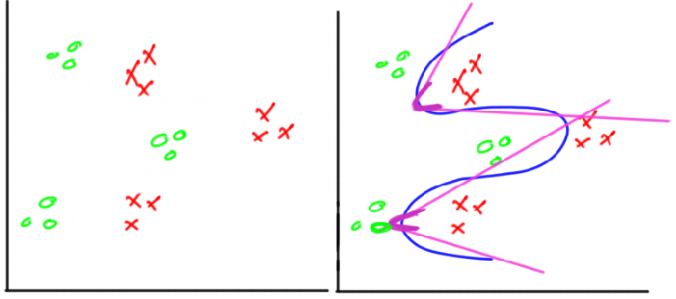
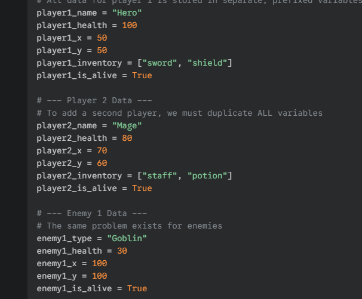
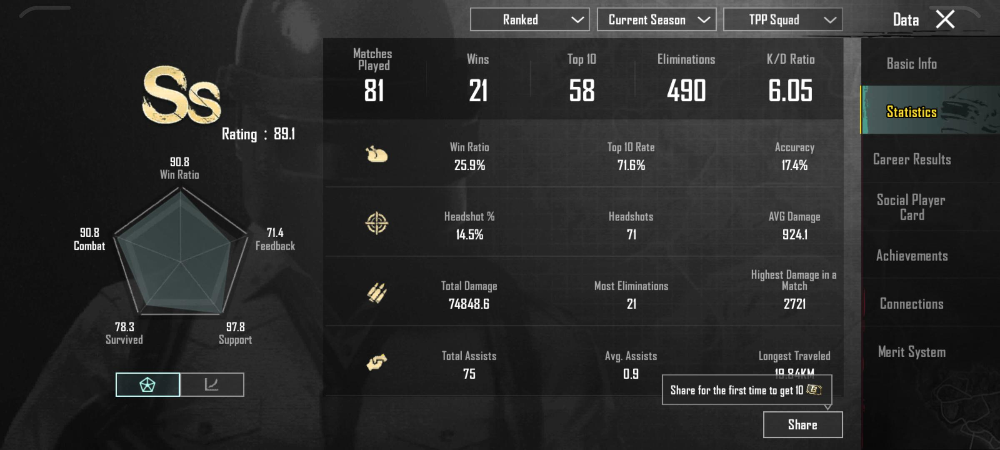
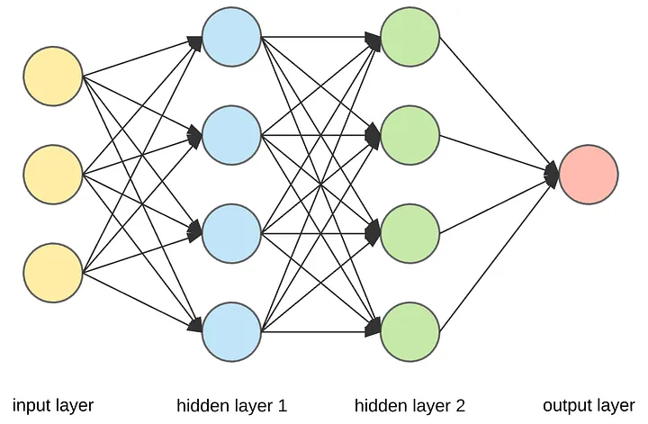
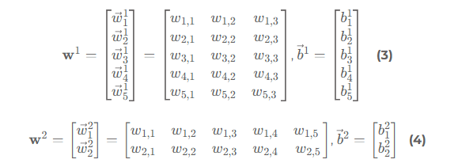
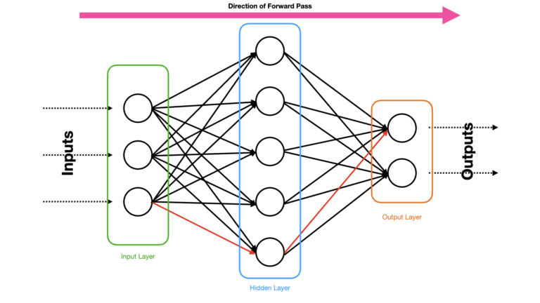

# Lab 02: Multi-Layer Perceptron - Instructor Guide (Part 1 of 3)

## Neural Networks Course - Computer Engineering

**Complete Self-Contained Teaching Resource**

---

## 📋 Lab Overview

**Duration:** 4 hours  
**Difficulty:** Intermediate  
**Prerequisites:** Lab 01 - Single Neuron  
**Learning Objectives:**

- Understand limitations of single neurons
- Learn multi-layer neural network architecture
- Master Object-Oriented Programming (OOP) in Python
- Implement a complete Multi-Layer Perceptron (MLP)
- Apply MLP to real AI problems

**Guide Structure:**

- **Part 1** (This file): Review & Limitations + OOP Tutorial (Sections 1-2)
- **Part 2**: Architecture, Mathematics & Implementation (Sections 3-5)
- **Part 3**: Application, Tasks & Assessment (Sections 6-7)

---

## 🎯 Teaching Strategy

This lab uses a **building-up approach**:

1. **Review & Limitations** - Why single neurons aren't enough
2. **OOP Introduction** - Using PUBG Mobile game analogy (detailed!)
3. **Architecture** - Understanding layers and connections
4. **Mathematics** - Forward propagation through layers
5. **Implementation** - Build MLP with and without OOP
6. **Application** - Solve real AI problem
7. **Task** - Practical assignment

---

## 🔄 SECTION 1: Review and Limitations (20 minutes)

### 1.1 Single Neuron Recap

**What to Say:**
"Let's quickly review what we learned in Lab 01. A single neuron performs two simple steps:

1. Calculate weighted sum of inputs plus bias: z = w₁x₁ + w₂x₂ + ... + b
2. Apply activation function: output = f(z)

This works great for simple problems where data can be separated by a straight line."

**Board Example - Water Temperature Classifier (from Lab 01):**

Draw on board:

```
Inputs: Touch(0.9), Visual(0.3), Context(0.1)
Weights: [0.7, 0.2, 0.1]
Bias: -2.0

z = (0.7 × 0.9) + (0.2 × 0.3) + (0.1 × 0.1) + (-2.0)
z = 0.63 + 0.06 + 0.01 - 2.0 = -1.3

output = step(-1.3) = 0 (COLD)
```

**Key Point:** "Single neurons create a LINEAR decision boundary - like drawing a single straight line to separate two groups."


---

### 1.2 The XOR Problem - The Breaking Point

**Interactive Demo:**

**Step 1 - Introduce XOR:**
"XOR means 'exclusive OR' - the output is 1 when inputs are DIFFERENT, and 0 when they're the SAME."

Draw truth table on board:

```
XOR Truth Table:
A | B | Output | Meaning
--|---|--------|------------------
0 | 0 |   0    | Both OFF → OFF
0 | 1 |   1    | Different → ON
1 | 0 |   1    | Different → ON
1 | 1 |   0    | Both ON → OFF
```

**Real-World Example:**
"Think of a room with two light switches. XOR means: the light is ON only when the switches are in DIFFERENT positions. If both switches are UP or both are DOWN, the light is OFF."

**Step 2 - Plot the Data:**

Draw coordinate system on board:

```
     1 |
       |  O (1,0)    ✓ (1,1)
       |  [1]        [0]
       |
       |
     0 |  ✓ (0,0)   O (0,1)
       |  [0]        [1]
       |________________
          0           1

Legend:
✓ = Class 0 (output should be 0)
O = Class 1 (output should be 1)
```

**Step 3 - The Challenge:**

**Ask students:** "Can anyone draw a SINGLE straight line that separates the O's from the ✓'s?"

Give them 30 seconds to try.

**Reveal:** "It's impossible! No matter which way you draw a line, you can't separate the two classes. This is called a NON-LINEARLY SEPARABLE problem."

**Mathematical Proof (Optional for advanced students):**
"For a single neuron to work, we need: w₁x₁ + w₂x₂ + b > 0 for one class and < 0 for the other. Try any values for w₁, w₂, and b - you'll fail for XOR!"

Example attempt:

```
Try: w₁=1, w₂=1, b=-0.5

(0,0): 1(0) + 1(0) - 0.5 = -0.5  (negative, outputs 0) ✓
(0,1): 1(0) + 1(1) - 0.5 = 0.5   (positive, outputs 1) ✓
(1,0): 1(1) + 1(0) - 0.5 = 0.5   (positive, outputs 1) ✓
(1,1): 1(1) + 1(1) - 0.5 = 1.5   (positive, outputs 1) ✗ WRONG!

We need (1,1) to output 0, but it outputs 1. Impossible!
```


**Key Takeaway:** "Single neurons are LIMITED. They can only solve linearly separable problems. Real-world AI needs more power!"

---

### 1.3 Why We Need Multiple Layers - The Solution

**What to Say:**
"The solution is simple but powerful: use MULTIPLE neurons arranged in LAYERS. This allows us to create complex, curved decision boundaries."

**Visualization on Board:**

Draw progression:

```
1. Single Neuron = Single Line
   |    /
   |  /
   | /
   |/________

2. Multiple Neurons (Same Layer) = Multiple Lines
   |  \  /
   |   \/
   |   /\
   |  /  \____

3. Multiple Layers = Curved Boundaries!
   |    ╱╲
   |   ╱  ╲
   |  │    │
   |  ╰────╯
```

**Intuitive Explanation:**
"Think of it like building with LEGO:

- Single neuron = Single LEGO brick (limited)
- Multiple neurons = Multiple bricks (can build simple shapes)
- Multiple LAYERS = Can build complex 3D structures!"

**Mathematical Intuition (Don't go too deep):**
"Each neuron in the first layer creates one decision boundary (line).
The second layer combines these lines to create complex shapes.
More layers = more complex patterns!"

**Real-World Examples - Make it Relatable:**

Ask students: "What are some AI problems that need complex patterns?"

Then present these examples:

**1. Face Recognition (كشف الوجه)**

```
Simple Feature: "Is there an eye?" → Single neuron could detect
Complex Pattern: "Is this Ahmed vs. Mohamed?" → Needs many layers!

Why complex?
- Face angle changes
- Lighting variations
- Facial expressions
- Accessories (glasses, beard)

Multiple layers extract: edges → features → facial components → identity
```

**2. Speech Recognition (Egyptian Dialect Example)**

```
Simple: Detect if someone is speaking → Single neuron
Complex: Understand "ازيك يا صاحبي" vs "أخبارك يا صديقي" → Needs layers!

Why complex?
- Different pronunciations
- Background noise
- Speaker variations
- Context matters

Multiple layers extract: sound waves → phonemes → words → meaning
```

**3. Game Playing (PUBG Mobile)**

```
Simple: "Is enemy visible?" → Single neuron
Complex: "Should I rush, retreat, or flank?" → Needs layers!

Why complex?
- Map awareness
- Team positions
- Weapon/ammo status
- Circle location
- Health/armor state

Multiple layers process: raw game state → tactical features → strategy
```

**4. Medical Diagnosis**

```
Simple: "Is temperature above 38°C?" → Single neuron
Complex: "Does patient have COVID, flu, or bacterial infection?" → Needs layers!

Why complex?
- Multiple symptoms interact
- Patient history matters
- Lab results correlation
- Symptom severity combinations

Multiple layers combine: individual symptoms → patterns → diagnosis
```



**Summary Statement:**
"Single neurons are like having one tool - a hammer. Multi-layer networks are like having an entire toolbox - you can solve much more complex problems!"

**Transition to Next Section:**
"Now, to build these multi-layer networks properly, we need better coding tools. Imagine managing 100 players in PUBG Mobile using separate variables... nightmare! That's why we need Object-Oriented Programming. Let's learn it!"

---

## 🎮 SECTION 2: Object-Oriented Programming (60 minutes)

**CRITICAL NOTE:** This is the most important section! Many students struggle with OOP. Take your time, use the PUBG Mobile analogy extensively, and do lots of live coding.

### 2.1 The Problem Without OOP (10 minutes)

**Opening Question:**
"Who here plays PUBG Mobile? Great! Imagine you're developing PUBG and need to track 100 players in a match. How would you store each player's information?"

Wait for responses, then reveal the nightmare...

**Live Code - Type this in front of students:**

```python
# Managing just THREE players without OOP... 😱

# Player 1 - ProGamer
player1_name = "ProGamer"
player1_health = 100
player1_armor = 75
player1_position_x = 150.5
player1_position_y = 200.3
player1_weapon = "M416"
player1_ammo = 40
player1_kills = 3
player1_is_alive = True

# Player 2 - SnipeMaster
player2_name = "SnipeMaster"
player2_health = 80
player2_armor = 50
player2_position_x = 300.7
player2_position_y = 450.2
player2_weapon = "AWM"
player2_ammo = 15
player2_kills = 5
player2_is_alive = True

# Player 3 - SneakyNinja
player3_name = "SneakyNinja"
player3_health = 60
player3_armor = 0
player3_position_x = 500.1
player3_position_y = 100.8
player3_weapon = "UMP45"
player3_ammo = 25
player3_kills = 1
player3_is_alive = True

# And we need 97 MORE players! That's 900+ variables! 😱😱😱
```

**Point out on screen:**
"Look at this mess! Just THREE players require 27 variables. For 100 players, we'd need 900 variables!"

**Now Show Function Messiness:**

```python
def player_shoot_old(shooter_name, shooter_ammo,
                     target_name, target_health, target_armor,
                     damage=20):
    """Player shoots another player - SO MESSY!"""
    if shooter_ammo <= 0:
        print(f"{shooter_name} has no ammo!")
        return shooter_ammo, target_health, target_armor

    # Calculate damage
    absorbed = min(damage, target_armor)
    health_damage = damage - absorbed

    target_armor -= absorbed
    target_health -= health_damage
    shooter_ammo -= 1

    print(f"{shooter_name} shoots {target_name}!")
    print(f"  Damage: {damage}")
    print(f"  {target_name}'s health: {target_health}")

    # Return THREE values - error prone!
    return shooter_ammo, target_health, target_armor

# Using it is horrible:
player1_ammo, player2_health, player2_armor = player_shoot_old(
    player1_name, player1_ammo,  # Shooter info
    player2_name, player2_health, player2_armor,  # Target info
    25  # Damage
)

# 7 parameters! Easy to mix up!
# What if we accidentally swap target_health and target_armor?
```

**Run the code, show the output, then say:**

**Problems Summary (Write on board):**

```
❌ PROBLEMS WITHOUT OOP:

1. Variable Explosion: 900+ variables for 100 players
2. No Organization: Which variables belong together?
3. Error-Prone: Easy to use wrong variable
4. Function Complexity: Too many parameters
5. Code Duplication: Repeat same logic everywhere
6. Hard to Extend: Want to add "grenades"? Good luck!
7. Maintenance Nightmare: Finding bugs is torture
```

**Emphatic Statement:**
"This is how programming was done in the 1970s. There MUST be a better way! Enter Object-Oriented Programming!"



---

### 2.2 Introducing Classes and Objects (15 minutes)

**Core Concept Introduction:**

**What to Say:**
"OOP introduces two fundamental concepts: CLASSES and OBJECTS. Let me explain with PUBG Mobile..."

**Draw on board:**

```
┌─────────────────────────────────────────────┐
│     CHARACTER CREATION SCREEN (CLASS)        │
│                                             │
│  Name: _____________                        │
│  Starting Health: 100                       │
│  Starting Armor: 0                          │
│  Starting Position: Random                   │
│  Starting Weapon: Fists                     │
│                                             │
│         [Create Character]                   │
└─────────────────────────────────────────────┘
        ↓ Press button (Create object)
        ↓
    Your Actual Character (OBJECT)
    Name: "ProGamer"
    Health: 100
    Position: (150, 200)
    Weapon: "M416"
```

**Explanation:**

**CLASS = Blueprint/Template**
"A class is like the character creation screen. It defines:

- What properties every player has (health, armor, position)
- What actions every player can do (move, shoot, heal)
- But it's NOT a player itself - it's just the template!"

**OBJECT = Specific Instance**
"An object is your ACTUAL character in the game. Each object:

- Has its own specific values (YOUR health, YOUR position)
- Can perform actions (YOU move, YOU shoot)
- Is independent (your health doesn't affect my health)"

**Multiple Analogies (Choose based on students):**

**Analogy 1 - Cookie Cutter:**

```
CLASS = Cookie cutter (the shape mold)
OBJECT = Cookie (individual cookie made from that mold)

One cutter can make hundreds of cookies!
One class can create hundreds of objects!
```

**Analogy 2 - Car Manufacturing (Egyptian Context):**

```
CLASS = Car blueprint at factory (تصميم السيارة)
OBJECT = Your actual car (سيارتك الخاصة)

Example:
- Blueprint: "Toyota Corolla 2025" (class)
- Your car: License plate "أ ه م 1234" (object)
- My car: License plate "ق هـ ج 5678" (object)

Same blueprint, different cars!
```

**Analogy 3 - University Courses:**

```
CLASS = Course syllabus (CSE234 Neural Networks)
OBJECT = Your enrollment in the course

The syllabus defines what every student learns (blueprint)
Your enrollment is your specific experience (object)
- Your grade
- Your attendance
- Your assignments
```

**Key Insight - Write on board:**

```
🔑 KEY INSIGHT:

   CLASS: Written ONCE, defines structure
   OBJECTS: Created MANY times, have specific values

   ONE class → MANY objects

   Like: ONE character creation screen → 100 players in match
```



---

### 2.3 PUBG Mobile Example - Live Coding (25 minutes)

**Important:** Type this code LIVE in front of students. Don't just show them! Type, explain, run, repeat.

**Part A - Creating the Player Class (10 minutes)**

**Say:** "Let's create a Player class - the blueprint for all PUBG players."

**Type slowly and explain each part:**

```python
class Player:
    """
    Blueprint for creating PUBG Mobile players.

    This defines what every player should have (attributes)
    and what every player can do (methods).
    """

    def __init__(self, name, starting_position=(0, 0)):
        """
        Constructor: Runs automatically when creating a new player.
        Think: The "Create Character" button in PUBG!

        Parameters:
            name: Player's name
            starting_position: Starting (x, y) coordinates
        """
        # Attributes (properties) - data each player has
        self.name = name
        self.health = 100  # Everyone starts with 100 health
        self.armor = 0     # Start with no armor
        self.position = list(starting_position)
        self.weapon = "Fists"  # Start with no weapon
        self.ammo = 0
        self.kills = 0
        self.is_alive = True

        print(f"✓ Player '{self.name}' created at {self.position}")
```

**STOP and explain each part:**

**1. Class Definition:**

```python
class Player:
```

**Say:** "This line says: 'I'm defining a new type of thing called Player.' Like creating a new character template in PUBG."

**2. The `__init__` Method (Constructor):**

```python
def __init__(self, name, starting_position=(0, 0)):
```

**Say:** "This is special! Two underscores before and after 'init'.

- This method runs AUTOMATICALLY when you create a new player
- Think of it as the 'Create Character' button being pressed
- It sets up initial values for the new player"

**3. The `self` Parameter:**
**Say:** "Every method in a class must have `self` as first parameter. What is `self`?

`self` means 'this specific player' - from the player's perspective:

- `self.health` = MY health
- `self.weapon` = MY weapon
- `self.position` = MY position

When ProGamer shoots, `self` refers to ProGamer.
When SnipeMaster shoots, `self` refers to SnipeMaster.

It's how each player keeps track of their own data!"

**4. Attributes (Properties):**

```python
self.name = name
self.health = 100
self.armor = 0
# etc.
```

**Say:** "These are attributes - data stored in the player object.

- `self.name`: Each player has their own name
- `self.health`: Each player has their own health
- `self.weapon`: Each player has their own weapon

Notice: Some come from parameters (name), others are defaults (health=100)"

**Run the Code - Create First Player:**

```python
# Create first player
player1 = Player("ProGamer", (150, 200))
```

**Output:**

```
✓ Player 'ProGamer' created at [150, 200]
```

**Explain what happened:**
"When we wrote `Player("ProGamer", (150, 200))`:

1. Python creates a new Player object in memory
2. Automatically calls `__init__` method
3. Sets `self.name = "ProGamer"`
4. Sets `self.position = [150, 200]`
5. Sets all other default values
6. Returns the object and stores it in `player1`

Now `player1` is a complete player with all attributes!"

**Show Object Contents:**

```python
# Access player's attributes
print(f"Name: {player1.name}")
print(f"Health: {player1.health}")
print(f"Position: {player1.position}")
print(f"Weapon: {player1.weapon}")
```

**Output:**

```
Name: ProGamer
Health: 100
Position: [150, 200]
Weapon: Fists
```

**Part B - Adding Methods (Actions) (15 minutes)**

**Say:** "Now let's add methods - actions that players can perform!"

**Type these methods into the Player class:**

```python
    def move(self, new_x, new_y):
        """
        Move the player to a new position.

        This is a METHOD - an action the player can perform.
        """
        old_pos = self.position.copy()
        self.position = [new_x, new_y]
        print(f"{self.name} moved from {old_pos} to {self.position}")

    def pickup_weapon(self, weapon_name, ammo_count):
        """Pick up a weapon and ammo."""
        self.weapon = weapon_name
        self.ammo = ammo_count
        print(f"{self.name} picked up {weapon_name} with {ammo_count} ammo!")

    def pickup_armor(self, armor_value):
        """Pick up armor."""
        self.armor = armor_value
        print(f"{self.name} picked up Level {armor_value} armor!")

    def shoot(self, target, damage=20):
        """
        Shoot another player.

        Parameters:
            target: The player being shot (another Player object!)
            damage: Amount of damage to deal
        """
        # Check if shooter has ammo
        if self.ammo <= 0:
            print(f"❌ {self.name} has no ammo!")
            return False

        # Check if target is alive
        if not target.is_alive:
            print(f"❌ {target.name} is already eliminated!")
            return False

        # Use one ammo
        self.ammo -= 1

        # Calculate damage (armor absorbs some)
        absorbed = min(damage, target.armor)
        health_damage = damage - absorbed

        # Apply damage
        target.armor -= absorbed
        target.health -= health_damage

        print(f"💥 {self.name} shoots {target.name}!")
        print(f"   Damage: {damage} (Armor: {absorbed}, Health: {health_damage})")
        print(f"   {target.name}: Health={target.health}, Armor={target.armor}")

        # Check if target is eliminated
        if target.health <= 0:
            target.is_alive = False
            self.kills += 1
            print(f"   💀 {target.name} eliminated!")
            print(f"   🏆 {self.name} now has {self.kills} kills!")
            return True

        return False

    def heal(self, amount=50):
        """Use a medkit to heal."""
        if not self.is_alive:
            print(f"❌ {self.name} is eliminated and cannot heal!")
            return

        old_health = self.health
        self.health = min(100, self.health + amount)  # Cap at 100
        healed = self.health - old_health
        print(f"💊 {self.name} used medkit: +{healed} HP (Now: {self.health})")

    def get_status(self):
        """Display player's current status."""
        status = "ALIVE ✓" if self.is_alive else "ELIMINATED ✗"
        print(f"\n📊 {self.name} [{status}]")
        print(f"   Health: {self.health}/100")
        print(f"   Armor: {self.armor}")
        print(f"   Position: {self.position}")
        print(f"   Weapon: {self.weapon} (Ammo: {self.ammo})")
        print(f"   Kills: {self.kills}")
```

**Explain Methods:**

**What to Say:**
"Methods are functions that belong to a class. They define ACTIONS that objects can perform.

Key points:

1. Always have `self` as first parameter (refers to the object)
2. Can access/modify object's attributes using `self.attribute`
3. Called on specific objects: `player1.shoot(player2)`"

**Example Walkthrough - `shoot` method:**

Draw on board:

```
player1.shoot(player2, 25)
       ↓
When this runs:
1. self = player1 (the shooter)
2. target = player2 (being shot)
3. damage = 25

Inside method:
- self.ammo (player1's ammo) decreases
- target.health (player2's health) decreases
- self.kills (player1's kills) might increase

See? Each player tracks their own data!
```

**Part C - Complete Demo (Run Full Example)**

```python
print("\n" + "="*70)
print("PUBG MOBILE MATCH SIMULATION")
print("="*70)

# Create three players
print("\n--- Creating Players ---")
player1 = Player("ProGamer", (150, 200))
player2 = Player("SnipeMaster", (300, 450))
player3 = Player("SneakyNinja", (500, 100))

# Show initial status
player1.get_status()
player2.get_status()

# Looting phase
print("\n--- Looting Phase ---")
player1.pickup_weapon("M416", 40)
player1.pickup_armor(75)

player2.pickup_weapon("AWM", 15)
player2.pickup_armor(50)

player3.pickup_weapon("UMP45", 25)
# player3 finds no armor!

# Movement
print("\n--- Movement ---")
player1.move(200, 250)
player2.move(320, 470)

# Combat!
print("\n--- COMBAT! ---")
player1.shoot(player2, 25)
player2.shoot(player1, 35)
player3.shoot(player2, 20)

# Healing
print("\n--- Healing ---")
player2.heal(50)

# More combat
print("\n--- Intense Battle! ---")
player1.shoot(player2, 30)
player1.shoot(player2, 30)

# Final status
print("\n" + "="*70)
print("FINAL STANDINGS")
print("="*70)
player1.get_status()
player2.get_status()
player3.get_status()
```

**Run this and let students watch the simulation!**

**After running, emphasize:**

**Compare the Difference:**

Write on board side-by-side:

```
WITHOUT OOP:                    WITH OOP:
────────────────                ────────────
player1_ammo, player2_health,   player1.shoot(player2, 25)
player2_armor = shoot(
  player1_name,                 Clean! Clear! Professional!
  player1_ammo,
  player2_name,
  player2_health,
  player2_armor,
  25
)

Messy! Confusing! Error-prone!
```

**Key Takeaway Statement:**
"With OOP, we went from managing 900+ variables to creating ONE class and 100 objects. Code is cleaner, easier to understand, and professional. This is why ALL modern software uses OOP!"

---

### 2.4 Key OOP Concepts Summary (10 minutes)

**Create a reference sheet on board:**

```
┌──────────────────────────────────────────────────────────┐
│              KEY OOP CONCEPTS SUMMARY                     │
└──────────────────────────────────────────────────────────┘

1. CLASS (الكلاس - النموذج)
   ├─ Definition: Blueprint/template
   ├─ Written once
   ├─ Defines structure and behavior
   └─ Example: class Player:

2. OBJECT (الكائن - النسخة)
   ├─ Definition: Instance created from class
   ├─ Has its own unique data
   ├─ Multiple can exist from one class
   └─ Example: player1, player2, player3

3. ATTRIBUTES (الخصائص - البيانات)
   ├─ Definition: Data stored in objects
   ├─ Accessed with: self.attribute_name
   ├─ Each object has its own copy
   └─ Example: self.health, self.weapon

4. METHODS (الدوال - الأفعال)
   ├─ Definition: Functions belonging to class
   ├─ Can access/modify object's attributes
   ├─ Called on specific objects
   └─ Example: player1.shoot(), player2.move()

5. SELF (الذات - "أنا")
   ├─ Definition: Refers to "this specific object"
   ├─ First parameter in all methods
   ├─ How object tracks its own data
   └─ Think: self.health = "MY health"

6. __init__ (CONSTRUCTOR - المُنشئ)
   ├─ Definition: Special method that initializes objects
   ├─ Runs automatically when creating objects
   ├─ Sets up initial values
   └─ Example: player1 = Player("ProGamer")

7. ENCAPSULATION (التغليف)
   ├─ Definition: Bundling data and methods together
   ├─ Objects manage their own data
   ├─ Clean interface for interaction
   └─ Example: All player data in Player object
```

**Interactive Check - Ask Students:**

1. **"What's the difference between a class and an object?"**
   Expected: "Class is blueprint, object is instance"

2. **"Why do we need `self` in methods?"**
   Expected: "So each object knows its own data"

3. **"How do we create a new player?"**
   Expected: "player1 = Player('name')"

4. **"What happens when we call `__init__`?"**
   Expected: "It sets up initial values automatically"

---

### 2.5 Why OOP for Neural Networks (5 minutes)

**Transition Statement:**
"Now you might be thinking: 'This is great for games, but what about neural networks?' Let me show you!"

**Draw Network Structure on Board:**

```
Input Layer    Hidden Layer    Output Layer
   (3)            (4)             (2)

   x₁ ─────┐
           ├──→ h₁ ───┐
   x₂ ─────┤          ├──→ y₁
           ├──→ h₂ ───┤
   x₃ ─────┤          ├──→ y₂
           ├──→ h₃ ───┘
           │
           └──→ h₄
```

**Without OOP - The Nightmare:**

```python
# Managing layers manually - MESSY!
layer1_weights = [[...], [...], [...], [...]]  # 4 neurons × 3 inputs
layer1_biases = [..., ..., ..., ...]  # 4 biases
layer2_weights = [[...], [...]]  # 2 neurons × 4 inputs
layer2_biases = [..., ...]  # 2 biases

def forward_layer1(inputs, weights, biases):
    # Calculate layer 1
    pass

def forward_layer2(inputs, weights, biases):
    # Calculate layer 2
    pass

def predict(inputs):
    hidden = forward_layer1(inputs, layer1_weights, layer1_biases)
    output = forward_layer2(hidden, layer2_weights, layer2_biases)
    return output

# Want to add another layer? Rewrite everything! 😱
```

**With OOP - Clean and Professional:**

```python
class Layer:
    def __init__(self, num_inputs, num_neurons):
        self.weights = [...]  # Initialize weights
        self.biases = [...]   # Initialize biases

    def forward(self, inputs):
        # Calculate output for this layer
        return outputs

class NeuralNetwork:
    def __init__(self, architecture):
        self.layers = []
        # Create layers automatically
        for i in range(len(architecture)-1):
            layer = Layer(architecture[i], architecture[i+1])
            self.layers.append(layer)

    def predict(self, inputs):
        activation = inputs
        # Pass through all layers automatically
        for layer in self.layers:
            activation = layer.forward(activation)
        return activation

# Create any network easily!
network = NeuralNetwork([3, 4, 2])  # Done!
output = network.predict([1, 0, 1])

# Want to add layers? Just change the list!
network = NeuralNetwork([3, 8, 8, 4, 2])  # 5-layer network!
```

**Benefits for Neural Networks (Write on board):**

```
✓ BENEFITS OF OOP FOR NEURAL NETWORKS:

1. Easy Architecture Changes
   - Change [3,4,2] to [3,8,8,4,2] → Done!

2. Encapsulation
   - Each layer manages its own weights
   - Network manages its layers

3. Reusability
   - Write Layer class once, use everywhere

4. Scalability
   - Add 10 more layers? No problem!
   - Add new layer types? Just create new class!

5. Maintainability
   - Find bugs easily
   - Modify one layer without breaking others

6. Professional Code
   - Readable, organized, clean
   - Industry standard approach
```

**Final Emphatic Statement:**
"In the next sections, we'll build a complete multi-layer perceptron using OOP. You'll see how much cleaner and more powerful this approach is. But first, any questions about OOP?"

**Take questions, then continue to Part 2 of the guide!**

---

**END OF PART 1**

**Continue to: [instructor-guide-part2.md](./instructor-guide-part2.md) for Sections 3-5**

- Section 3: MLP Architecture
- Section 4: Mathematics of Forward Propagation
- Section 5: Implementation (OOP vs Procedural)

**Then: [instructor-guide-part3.md](./instructor-guide-part3.md) for Sections 6-7**

- Section 6: Practical Application (Iris Dataset)
- Section 7: Student Tasks & Assessment

---

**Version:** 2.0 - Complete Self-Contained Edition  
**Date:** November 2025  
**Course:** Neural Networks - Computer Engineering

## 🏗️ Part 3: Multi-Layer Perceptron Architecture (45 minutes)

### Teaching Points

#### 3.1 MLP Structure

**Three Types of Layers:**

1. **Input Layer**
   - Not really a "layer" of neurons
   - Just holds the input data
   - Number of nodes = number of features
2. **Hidden Layer(s)**
   - Where the "magic" happens
   - Extract features and patterns
   - Can have multiple hidden layers (deep learning!)
   - Each neuron connected to all previous layer neurons
3. **Output Layer**
   - Produces final prediction
   - Number of nodes = number of classes/outputs

- Binary classification: 1 or 2 nodes
- Multi-class: multiple nodes



#### 3.2 Network Notation**Common notation:**

- Architecture: [3, 4, 2]
  - 3 input features
  - 4 hidden neurons
  - 2 output neurons

**Example: Email Spam Classifier**


- **Input layer:** 10 features (word frequencies)
- **Hidden layer 1:** 8 neurons
- **Hidden layer 2:** 4 neurons
- **Output layer:** 1 neuron (spam/not spam)
- **Architecture:** [10, 8, 4, 1]

#### 3.3 Connections and Weights

**Key Points:**

- **Fully Connected:** Each neuron connects to all neurons in next layer
- **Weight Matrix:** All connections have weights
- For layer with m inputs and n neurons: m × n weights
- **Number of parameters:** Can get very large!

**Example calculation:**

```
Architecture: [3, 4, 2]

Layer 1 (Input → Hidden):
- Inputs: 3
- Neurons: 4
- Weights: 3 × 4 = 12
- Biases: 4
- Total: 16 parameters

Layer 2 (Hidden → Output):
- Inputs: 4
- Neurons: 2
- Weights: 4 × 2 = 8
- Biases: 2
- Total: 10 parameters

Total network: 16 + 10 = 26 parameters
```



---

## 📐 Part 4: Mathematics of Forward Propagation (45 minutes)

### Teaching Points

#### 4.1 Layer-by-Layer Computation

**General formula for one layer:**

For layer ℓ:

$$
\mathbf{z}^{(\ell)} = \mathbf{W}^{(\ell)} \mathbf{a}^{(\ell-1)} + \mathbf{b}^{(\ell)}
$$

$$
\mathbf{a}^{(\ell)} = f(\mathbf{z}^{(\ell)})
$$

**Symbol explanation:**

- **ℓ:** Layer number (superscript in parentheses)
- **z^(ℓ):** Net input vector for layer ℓ
- **W^(ℓ):** Weight matrix for layer ℓ
- **a^(ℓ-1):** Activation output from previous layer (inputs to this layer)
- **b^(ℓ):** Bias vector for layer ℓ
- **f:** Activation function
- **a^(ℓ):** Activation output of layer ℓ
- **Bold letters:** Vectors/matrices (multiple values)

**Note:** a^(0) = input features

#### 4.2 Concrete Example: XOR Solution

**Network:** [2, 2, 1] - solves XOR!

**Step-by-step calculation:**

Given input: [1, 0]

**Hidden Layer Calculation:**

Weights W^(1):

```
W^(1) = [[1.0, 1.0],
         [1.0, 1.0]]
```

Biases: b^(1) = [-0.5, -1.5]

Neuron 1:

```
z₁ = (1.0 × 1) + (1.0 × 0) + (-0.5) = 0.5
a₁ = sigmoid(0.5) ≈ 0.62
```

Neuron 2:

```
z₂ = (1.0 × 1) + (1.0 × 0) + (-1.5) = -0.5
a₂ = sigmoid(-0.5) ≈ 0.38
```

Hidden layer output: [0.62, 0.38]

**Output Layer Calculation:**

Weights W^(2): [1.0, -2.0]
Bias: b^(2) = -0.5

```
z = (1.0 × 0.62) + (-2.0 × 0.38) + (-0.5) = -0.64
output = sigmoid(-0.64) ≈ 0.35 ≈ 0 (XOR output for [1,0])
```

**Work through all 4 XOR cases on board!**



#### 4.3 Matrix Formulation

**Why matrices?**

- Efficient computation
- Clean code
- Leverage optimized libraries (NumPy)

**Example:**

```
Input: [1, 0]
W^(1) = [[1.0, 1.0],
         [1.0, 1.0]]
b^(1) = [-0.5, -1.5]

Matrix multiplication:
z^(1) = W^(1) × input + b^(1)
     = [[1.0, 1.0],  × [1]  + [-0.5]
        [1.0, 1.0]]    [0]    [-1.5]
     = [0.5, -0.5]
```

**Teach matrix dimensions:**

- (m × n) matrix × (n × 1) vector = (m × 1) vector
- Must match inner dimensions!

---

## 💻 Part 5: Implementation (60 minutes)

### Teaching Points

**Note to Instructor:** Show both versions side-by-side to emphasize OOP benefits.

#### 5.1 Without OOP (Procedural)

Refer to `mlp-implementation.py` - Section 1

**Show students:**

```python
# Many global variables
weights_layer1 = [...]
biases_layer1 = [...]
weights_layer2 = [...]
biases_layer2 = [...]

# Functions with many parameters
def forward_layer1(inputs, weights, biases):
    # ...

def forward_layer2(inputs, weights, biases):
    # ...

# Main prediction function ties it all together
def predict(inputs):
    hidden = forward_layer1(inputs, weights_layer1, biases_layer1)
    output = forward_layer2(hidden, weights_layer2, biases_layer2)
    return output
```

**Problems:**

- Hard to scale to more layers
- Lots of parameter passing
- Difficult to maintain
- Error-prone

#### 5.2 With OOP (Clean)

Refer to `mlp-implementation.py` - Section 2

**Show the clean version:**

```python
class MLP:
    def __init__(self, architecture):
        self.layers = []
        # Build layers automatically

    def forward(self, inputs):
        # Clean propagation through layers

    def predict(self, inputs):
        # Simple interface
```

**Benefits:**

- Easy to add layers
- Encapsulated logic
- Reusable
- Professional code structure

**Live Coding:**

- Build the MLP class step by step
- Test with XOR problem
- Show how easy it is to change architecture

#### 5.3 Testing and Validation

**Demonstrate:**

1. Create simple test cases
2. Verify XOR solution works
3. Show how to debug layer by layer
4. Print intermediate values

---

## 🎯 Part 6: Practical Application (45 minutes)

### Teaching Points

#### 6.1 Real Problem: Iris Flower Classification

**Dataset:** Iris flowers - classic ML dataset

- **3 species:** Setosa, Versicolor, Virginica
- **4 features:** Sepal length, sepal width, petal length, petal width
- **150 samples:** 50 of each species


**Why this problem?**

- Multi-class classification (3 classes)
- Real botanical data
- Manageable size
- Visual patterns


#### 6.2 Network Design

**Architecture choice:**

- **Input:** 4 features → 4 nodes
- **Hidden:** 8 neurons (good starting point)
- **Output:** 3 neurons (one per class)
- **Architecture:** [4, 8, 3]

**Activation functions:**

- Hidden layer: ReLU (fast, effective)
- Output layer: Softmax (for multi-class probability)
-

**Softmax function:**

$$
\text{softmax}(z_i) = \frac{e^{z_i}}{\sum_{j} e^{z_j}}
$$

Converts outputs to probabilities that sum to 1.

.png>)

#### 6.3 Implementation Walkthrough

Refer to `mlp-implementation.py` - Section 3

**Cover:**

1. Data loading and preprocessing
2. Network initialization
3. Making predictions
4. Interpreting results

**Important:** This lab focuses on understanding MLP structure, NOT training.
Training (backpropagation) comes in later labs.

---

## 📝 Part 7: Student Task (30 minutes)

**Note to Instructor:**
Assign the tasks from `student-task.py`.

### Task Overview:

1. **Task 1:** Implement digit recognition network (0-9)

   - Design appropriate architecture
   - Understand why certain architectures work better

2. **Task 2:** Experiment with different architectures
   - Compare shallow vs deep networks
   - Understand tradeoffs
3. **Task 3:** Build a game move predictor
   - Practical application
   - Multiple inputs and outputs

**Grading Rubric:**

- Correct implementation: 50%
- Architecture justification: 20%
- Testing and analysis: 15%
- Code quality and comments: 15%

---

## 🎓 Assessment Checklist

By the end of this lab, students should be able to:

- [ ] Explain why single neurons have limitations
- [ ] Describe MLP architecture components
- [ ] Understand forward propagation mathematics
- [ ] Explain OOP concepts (class, object, method)
- [ ] Implement a multi-layer perceptron in Python
- [ ] Apply MLP to classification problems
- [ ] Design appropriate network architectures

---

## 🔍 Common Student Difficulties

### Issue 1: OOP Confusion

**Problem:** Students don't understand `self`  
**Solution:** Use PUBG analogy - "self is like 'this player' knowing their own stats"

### Issue 2: Matrix Dimensions

**Problem:** Dimension mismatch errors  
**Solution:** Draw matrices on board, show dimension compatibility rules

### Issue 3: Forward Propagation Flow

**Problem:** Lost in the layer-to-layer calculations  
**Solution:** Step through one example with actual numbers on board

### Issue 4: Class vs Object

**Problem:** "When do I use the class vs the object?"  
**Solution:** "Class is the blueprint, object is the actual thing. You build objects from classes."

### Issue 5: Weight Initialization

**Problem:** "What values should weights start with?"  
**Solution:** Random small values (explain why in future training lab)

---

## 📚 Additional Resources

### For Students:

1. 3Blue1Brown - "Neural Networks" series (YouTube)
2. Python OOP Tutorial (Real Python)
3. Interactive MLP visualization tools

### For Instructor:

1. Nielsen - "Neural Networks and Deep Learning" (Chapters 1-2)
2. Goodfellow - "Deep Learning" (Chapter 6)
3. CS231n Stanford course notes

---

## 🕐 Time Management

| Activity              | Time        | Notes                            |
| --------------------- | ----------- | -------------------------------- |
| Review & Limitations  | 20 min      | Interactive discussion           |
| OOP Tutorial          | 60 min      | Live coding with PUBG example    |
| MLP Architecture      | 45 min      | Draw diagrams, explain structure |
| Mathematics           | 45 min      | Work through XOR on board        |
| Implementation        | 60 min      | Code along, show both versions   |
| Practical Application | 45 min      | Iris dataset example             |
| Student Task          | 30 min      | Independent work with support    |
| **Total**             | **4 hours** |                                  |

---

## 🎯 Next Lab Preview

In **Lab 03 - Training Neural Networks**, students will learn:

- Backpropagation algorithm
- Gradient descent optimization
- Loss functions
- How to train networks from scratch

**Preparation:** Students must understand forward propagation thoroughly. Lab 02 is the foundation!

---

**Version:** 1.0  
**Last Updated:** October 2025  
**Course:** Neural Networks - Computer Engineering  
**Institution:** [Your University Name]
